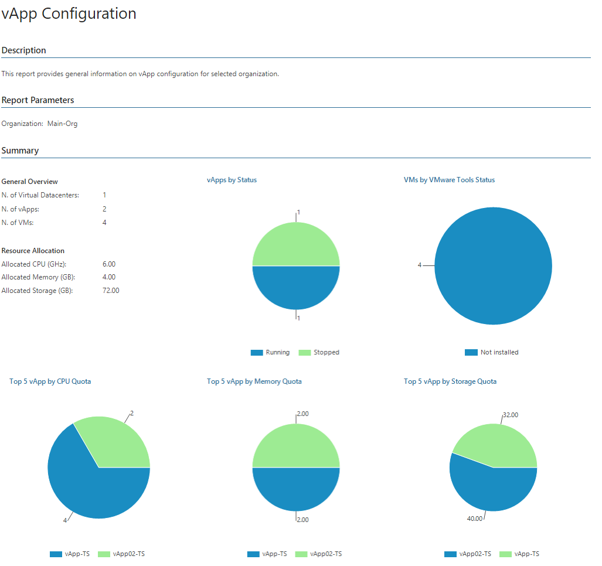
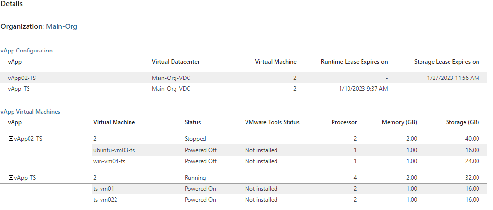

# vApp Configuration

This report provides an overview of vApp configuration for a selected organization.

* The Summary section includes the following elements:

+ The vApps by Status chart shows the number of powered off, powered on, resolved and suspended vApps.
+ The VMs by VMware Tools Status chart shows statuses of VMware Tools installed in VMs that belong to the organization.
+ The Top 5 vApp charts that display vApps with the highest level of CPU, memory and storage utilization.

* The Details table displays detailed information on configuration properties for each vApp created by organization users.

Report Parameters

You can specify the following report parameters:

* Organization: defines the organization whose vApps should be analyzed in the report.

Use Case

This report helps VMware Cloud Director administrator right-size resource provisioning to prevent resource waste and to eliminate potential performance bottlenecks.

