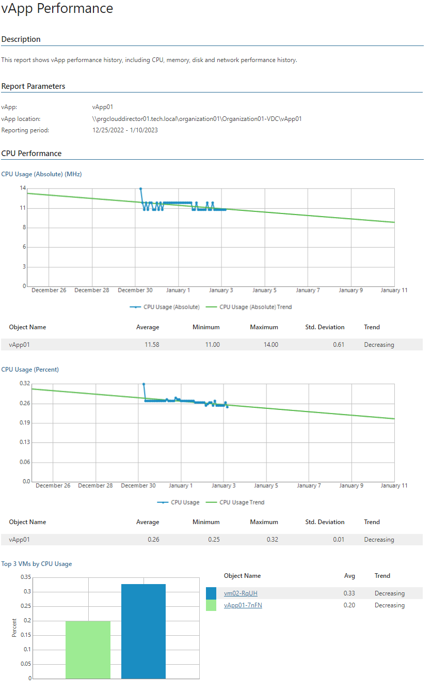

# vApp Performance

This report aggregates historical data and shows performance statistics for a selected vApp and resource pools across a time range.

* The Performance subsections show tables and performance charts with CPU, memory, disk and network usage statistics, list top resource consuming VMs and displays resource usage trends for them.

Report Parameters

You can specify the following report parameters:

* vApp: defines the vApp to analyze in the report.
* Period: defines the time period to analyze in the report.

* Business hours only: defines time of a day for which historical performance data will be used to calculate the performance trend. All data beyond this interval will be excluded from the baseline used for data analysis.

* Top N: defines the maximum number of VMs to display in the report output.

Use Case

The report helps you identify vApps with performance issues and decide whether additional right-sizing or reconfiguration actions are necessary.

Page updated 2026-08-07

