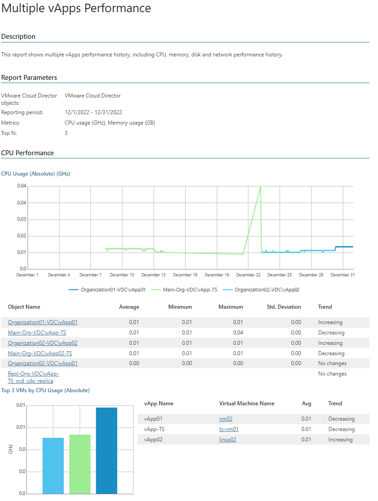

# Multiple vApps Performance

This report collects historical information and shows performance statistics on vApps over a specific time period. The report features a list of predefined performance counters and allows you to analyze memory, CPU, memory, disk and network usage.

* The Performance subsections show performance charts with resource usage statistics, rate the VMs by the resource usage level, and analyze the resource usage trend.

Report Parameters

You can specify the following report parameters:

* VMware Cloud Director objects: defines the organization whose vApps must be analyzed in the report.
* Period: defines the time period to analyze in the report.
* Business hours only: defines time of a day for which historical performance data will be used to calculate the performance trend. All data beyond this interval will be excluded from the baseline used for data analysis.
* Metrics: defines a list of performance counters to analyze in the report.
* Top N: defines the maximum number of VMs to display in the report output.
* Show graphs: defines whether to include charts in the report output.

Use Case

The report provides an overview resource consumption of multiple vApps. This information may help you identify VMs with performance issues, balance workloads, right-size resource provisioning and optimize overall performance.

