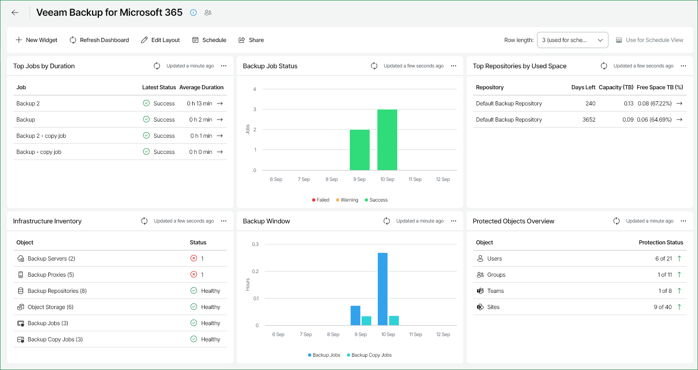

# Veeam Backup for Microsoft 365

The Veeam Backup for Microsoft 365 dashboard provides information on the state of the key Veeam Backup for Microsoft 365 infrastructure components. The built-in widgets display a list of important events and help focus on the core efficiency indicators.

You can access the Veeam Backup for Microsoft 365 dashboard from the Dashboard tab in Veeam ONE Web Client.

Widgets Included

Top Jobs by Duration

This widget displays top 5 jobs in terms of the longest duration, job completion status and the value of the average weekly duration. The widget helps you assess the backup infrastructure health and efficiency.

Arrows on the right show how job duration has changed over the previous week\*.

Backup Job Status

This widget provides information on the completion state of scheduled backup and backup copy jobs. It displays a daily summary of successfully completed jobs, and shows the number of jobs that completed with warnings and errors during the past week.

The widget helps you assess the efficiency of your data protection operations.

Top Repositories by Used Space

This widget displays 5 repositories that will run out of free space sooner than other repositories, as well as total capacity and free space left on these repositories. The widget also forecasts how many days remain before the repositories will run out of free space.

Arrows on the right show how the repository free space value has changed over the previous week\*.

To display object storage data in this widget, you must first set the capacity limit for these repositories in your Veeam Backup for Microsoft 365 configuration. To do this, select the Limit object storage consumption to check box and specify the limit value in GB, TB or PB. For details on see [Adding Object Storage Repositories](https://helpcenter.veeam.com/docs/vbo365/guide/adding_object_storage.html).

Infrastructure Inventory

This widget describes your Veeam Backup for Microsoft 365 infrastructure inventory and shows how many backup components of each type are deployed. The widget reflects the health state of backup infrastructure and displays how many objects have the Warning and Error statuses.

Backup Window

This widget shows the total duration of daily backup and backup copy job sessions. It allows you to track the efficiency of jobs, detect issues occurred in the backup process and to check whether jobs completed within the prescribed backup window.

Protected Objects Overview

This widget displays information on Microsoft 365 objects protected with backup jobs, specifically:

* Users — the total number of protected user accounts.

Note that shared mailboxes are counted as separate users.

* Groups  — the total number of protected user groups.
* Teams — the total number of protected Microsoft Teams teams.
* Sites — the total number of protected Microsoft 365 organization sites.

To display only objects with at least one restore point on the widget, select the Show only objects with at least 1 restore point check box.

\*The arrows allow you to compare the results of this week to the results of the previous week and to track how the trend has evolved. For example, a grey arrow pointing right next to the Duration value means that duration of the job has not changed over the past week, a green arrow pointing down means that job duration has decreased, while a red arrow pointing up means that job duration has increased.

