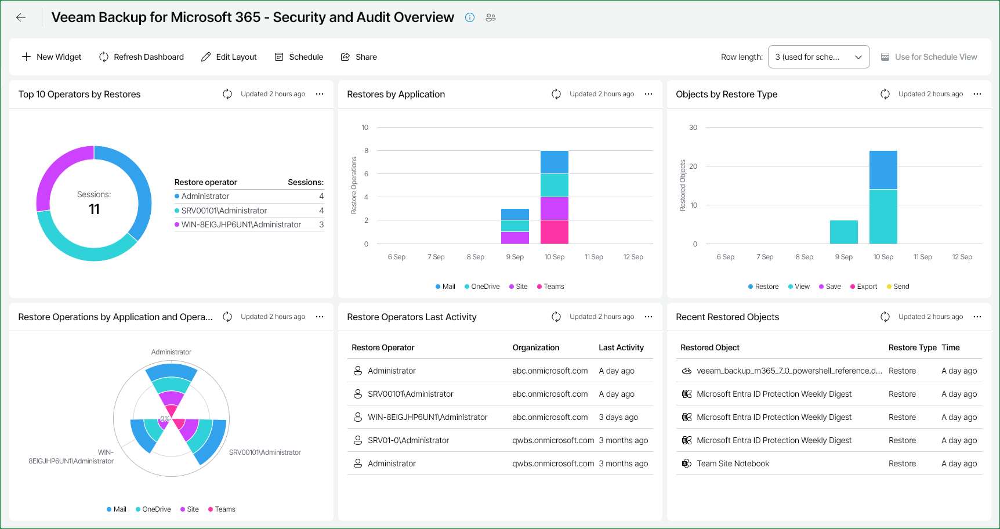

# Veeam Backup for Microsoft 365 - Security and Audit Overview

The Veeam Backup for Microsoft 365 - Security and Audit Overview dashboard provides detailed information on the state of Veeam Backup for Microsoft 365 restore operations. The built-in widgets display a list of important events and help focus on security and audit indicators. This allows you to monitor all restore activities performed by any authorized user and arrange this information by the type of performed restore actions.

|  |
| --- |
| Note: |
| Veeam ONE only collects information about restores from Veeam Backup for Microsoft 365 versions 8 and above. Restore data from versions below 8 is not presented in this dashboard. |

Widgets Included

Top 10 Restore Operators by Operations

This widget displays the top 10 users who have initiated the largest number of restore sessions or who have restored the largest number of objects. For details on operator roles, see [Data Restore Using Restore Portal](https://helpcenter.veeam.com/docs/vbo365/guide/ssp_restore.html).

Hover over the chart segment to break down information about each operator in your organization and the number of restore operations performed on the servers added to the widget scope.

This widget helps you assess the largest number of executed restore operations\* by operator in your organization.

Restore Operations by Application

This widget displays the number of restore operations\* by application type performed over a defined time period.

This widget helps you assess the most commonly restored applications in your organization.

Objects by Restore Type

This widget displays the number of restored objects by type of restore.

This widget helps you view the number of objects restored with a specific restore type. You can filter out restore type by clicking on the relevant restore type name at the bottom of the widget.

Restore Operations by Application and Operator

This widget allows you to filter and display a composite pie chart of your restore operations and applications for your Veeam Backup for Microsoft 365 infrastructure by user. Hover over the chart to provide additional details for each operator and their restored applications types\*.

You can filter out restores for a specific application by clicking on the relevant application name in the widget.

Restore Operators Last Activity

This widget displays a list of operators who performed the most recent restores in your infrastructure.

You can define the number of restore activity entries to display on the widget up to a maximum of 25 entries.

Recent Restored Objects

This widget displays the last 5 objects restored in your infrastructure. It provides the following information on each object: object name, type of restore (View, Save, Send, Export, Restore) and how long ago the operation was performed.

\*You can also configure the widget to display the number of restored objects. To do this, change the Group by parameter in the widget settings. For more information on editing widgets, see [Managing Widgets](manage_widgets.md).

