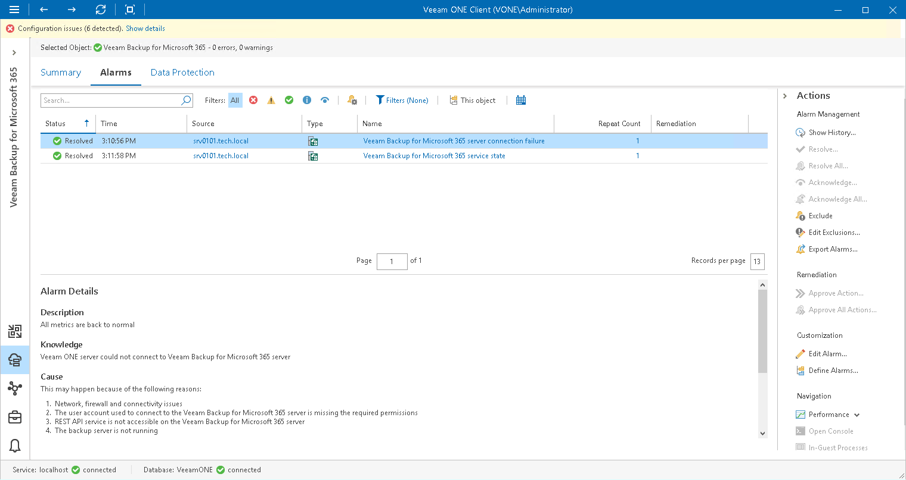

# Veeam Backup for Microsoft 365 Alarms

Veeam ONE includes a set of alarms to monitor the efficiency of Veeam Backup for Microsoft 365 data protection.

Predefined data protection alarms are configured to warn you about events or issues that can cause loss of data or prevent Veeam Backup for Microsoft 365 infrastructure from functioning properly:

* Connectivity issues and inability of backup infrastructure components to communicate with each other
* State of Veeam Backup for Microsoft 365 software installed on backup infrastructure components
* Failing jobs or jobs finished with warnings
* Configuration issues, such as fast decreasing space on backup repositories
* Long-running jobs that exceed the backup window
* Product license and prepaid support contract

To view the list of data protection alarms:

1. Open Veeam ONE Client.

For details, see [Accessing Veeam ONE Components](access.md).

1. At the bottom of the inventory pane, click Veeam Backup for Microsoft 365.
2. In the inventory pane, select the necessary backup infrastructure node.
3. Open the Alarms tab.

On the Alarms dashboard, you can view triggered alarms, track alarm history, resolve and acknowledge alarms and perform other actions. For details on available actions, see [Working with Triggered Alarms](triggered_alarms.md).

