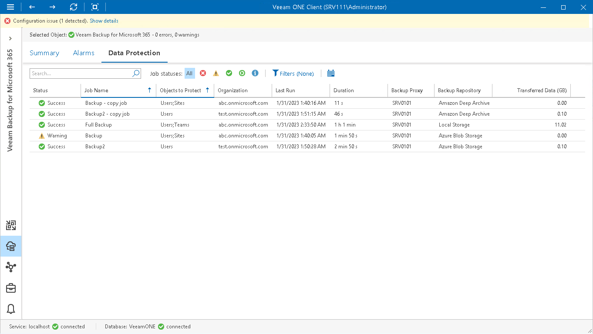

# Veeam Backup for Microsoft 365 Data Protection

Veeam ONE Client allows you to track jobs configured to protect Microsoft 365 objects with Veeam Backup for Microsoft 365.

You can track real-time job statistics at different levels of your infrastructure:

* Jobs on a specific Veeam Backup for Microsoft 365 server
* All jobs across the entire Veeam Backup for Microsoft 365 infrastructure

To view the list of jobs at the necessary backup infrastructure level:

1. Open Veeam ONE Client.

For details, see [Accessing Veeam ONE Components](access.md).

1. At the bottom of the inventory pane, click Veeam Backup for Microsoft 365.
2. In the inventory pane, select the necessary infrastructure node.
3. Open the Data Protection tab.
4. To find the necessary job, you can use filters at the top of the job list:

* To show or hide jobs that ended with a specific status, use the status buttons at the top of the list (Show failed jobs, Show jobs with warnings, Show successful jobs, Show running jobs or Show jobs with no status).
* To show or hide jobs of a specific type, use the job type filter at the top of the list (Backup, Backup copy).
* To show or hide jobs that protect specific object types, use the objects filter at the top of the list (Entire organization, Users, Groups, Sites, Teams).
* To set the time interval when jobs ran for the last time, use the Filter jobs by time period button. Release the button to discard the time period filter.
* To find jobs by name, use the search field at the top of the list.

The list of jobs shows all types of VM jobs for the backup infrastructure level that you selected in the inventory pane.

For every job, the following details are available:

* Status — the latest status of the job session (Success, Warning, Failed, Running, or jobs with no status).
* Job Name — name of a job.
* Objects to Protect — list of objects included in the job.
* Organization — name of Microsoft organization to which protected objects belong.
* Last Run — date and time of the latest job run.
* Duration — time taken to complete the job during its latest run.
* Backup Proxy — name of the backup proxy configured in job settings.
* Backup Repository — name of the target backup repository.
* Transferred Data (GB) — amount of backup data that was transferred to the target destination during the latest job run.

