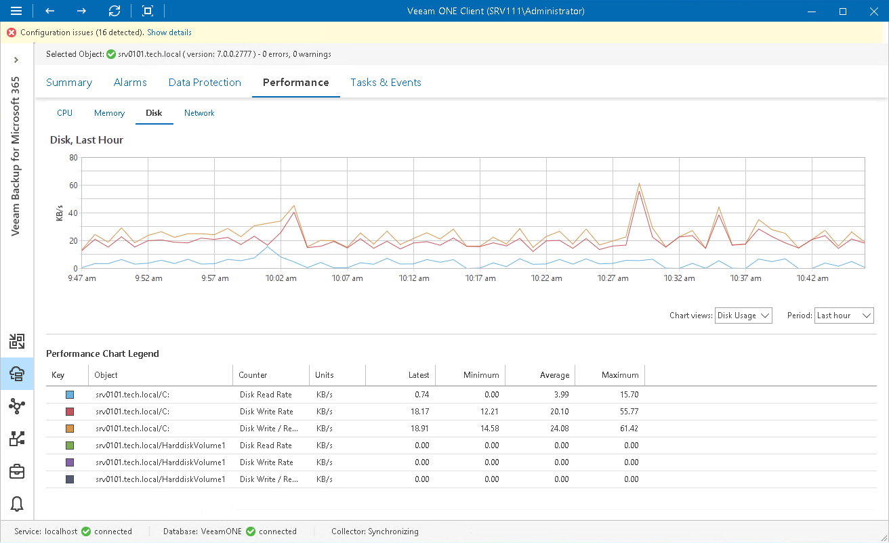

# Disk Performance Chart

The Disk chart shows the rate at which the disk is transferring data during read and write operations. Disk usage is shown as an average for all physical disks on a machine where a backup infrastructure component runs.

|  |
| --- |
| Note: |
| The Disk and Network tabs are not available for Linux-based proxies. |

