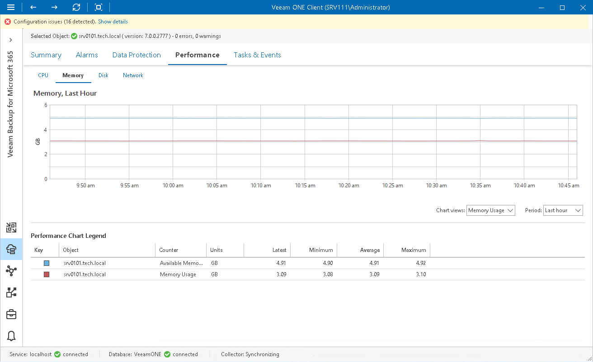

# Memory Performance Chart

The Memory chart shows the amount of used memory resources on a machine where a backup infrastructure component runs. Graphs in the Memory chart illustrate the amount of total available memory and memory that is currently used on the machine.

