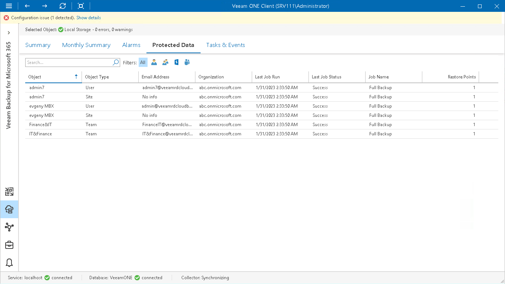

# Veeam Backup for Microsoft 365 Protected Data

The Protected Data tab allows you to view the list of protected Microsoft 365 objects stored in backups on backup and object storage repositories:

1. Open Veeam ONE Client.

For details, see [Accessing Veeam ONE Components](access.md).

1. At the bottom of the inventory pane, click Veeam Backup for Microsoft 365.
2. In the inventory pane, select the necessary repository.
3. Open the Protected Data tab.
4. To quickly find the necessary object, use the Search field and object type filter at the top of the list.

For every object in the list, the following details are shown:

* Object — name of the Microsoft 365 object stored in a backup on the repository.
* Object Type — type of Microsoft 365 object (Users, Groups, Sites, Teams).
* Email Address — address of the Microsoft 365 object.
* Organization — name of the Microsoft 365 to which the object belongs.
* Last Job Run — date and time of the latest job session.
* Last Job Status — status of the latest job session.
* Job Name — name of the data protection job to which the object is included.
* Restore Points — number of restore points stored on the backup repository.

