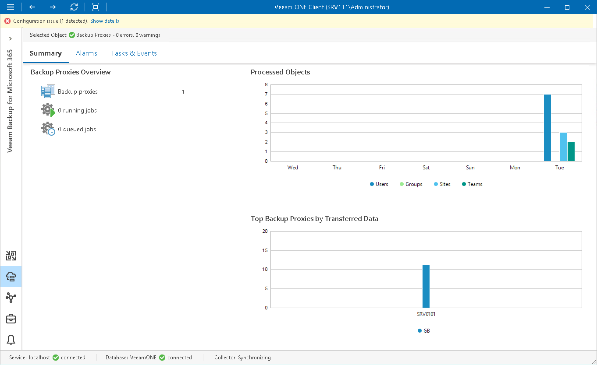

# Veeam Backup for Microsoft 365 Proxies Overview

The summary dashboard for the Backup Proxies node provides a configuration overview and performance analysis for backup proxies managed by a Veeam Backup for Microsoft 365 server.

This dashboard can help you detect configuration inefficiencies in your data protection infrastructure. If the same proxy server appears to process a great number of objects, transfer the greatest amount of backup data and use the largest backup window, you may need to re-balance the processing load across your backup proxies. The charts may also help you reveal 'lazy' proxies that you may decide to decommission.

Proxies can also be grouped together into proxy pools in order to operate as a single point of entry for your processing load. The backup proxy pool is a logical entity that groups any number of backup proxy servers.

Backup Proxies Overview

The section provides the total number of backup proxies for the chosen Veeam Backup for Microsoft 365 infrastructure node and the total number of running and queued jobs that these proxies process.

Processed Objects

The chart shows the number of Microsoft 365 objects (Users, Groups, Sites, Teams) whose data the proxies processed during the past week.

Top Backup Proxies by Transferred Data

The chart shows backup proxies that transferred the greatest amount of backup data to the target destination over the past 7 days.

For every proxy, the chart shows the total amount of data that the proxy transferred over the network after the source-side deduplication and compression. The chart can help you detect backup proxies that transfer the greatest amount of backup data and estimate the load that backup jobs impose on the network.

