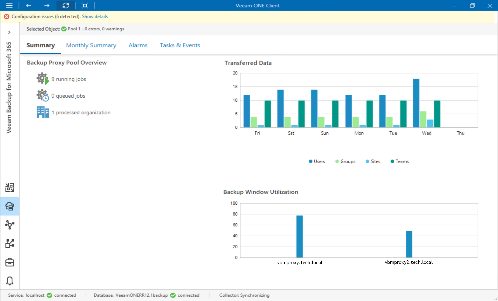

# Veeam Backup for Microsoft 365 Proxy Pools Summary

The proxy pool summary dashboard provides overview details and performance analysis for a chosen backup proxy pool for the last week or month.

Backup Proxy Overview

The Proxy Pools section provides the following details:

* Number of jobs that the proxy pool is currently processing

* Number of jobs queued for processing
* Number of processed Microsoft 365 organizations

Transferred Data

The chart shows the amount of backup data that the proxies in the pool transferred to the target destination (backup repository or object storage) over the last 7 days.

The chart shows the total amount of data that the proxy pool transferred over the network after the source-side deduplication and compression. The chart can help you measure the amount of backup traffic coming from the proxy pool.

Backup Window Utilization

The chart allows you to estimate how 'busy' the proxy pool was during the last 7 days. The chart shows the cumulative amount of time that the proxies in the pool was retrieving, processing and transferring Veeam Backup for Microsoft 365 data.

The chart can help you reveal possible resource bottlenecks. If the backup window on the chart is abnormally large, this can evidence of low source data retrieval speed, high proxy CPU load or insufficient network throughput.

