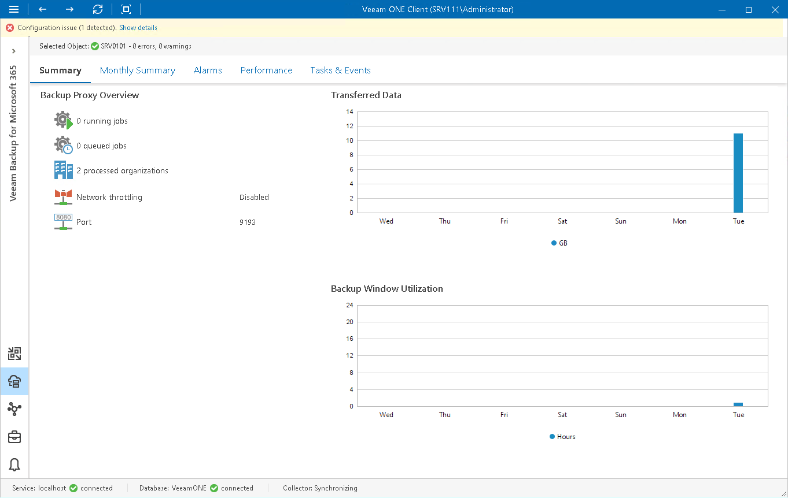

# Veeam Backup for Microsoft 365 Proxy Summary

The proxy summary dashboard provides overview details and performance analysis for a chosen backup proxy for the last week or month.

Backup Proxy Overview

The section provides the following details:

* Number of jobs that the proxy is currently processing

* Number of jobs queued for processing
* Number of Microsoft 365 organizations that are proxy processed
* Local Network throttling settings configured in the backup proxy settings
* Port through which the proxy communicates with Veeam Backup for Microsoft 365 server

Transferred Data

The chart shows the amount of backup data that the proxy transferred to the target destination (backup repository or object storage) over the last 7 days.

The chart shows the total amount of data that the proxy transferred over the network after the source-side deduplication and compression. The chart can help you measure the amount of backup traffic coming from the proxy.

Backup Window Utilization

The chart allows you to estimate how 'busy' the proxy was during the last 7 days. The chart shows the cumulative amount of time that the proxy was retrieving, processing and transferring Veeam Backup for Microsoft 365 data.

The chart can help you reveal possible resource bottlenecks. If the backup window on the chart is abnormally large, this can evidence of low source data retrieval speed, high proxy CPU load or insufficient network throughput. To identify performance bottlenecks, you can switch to proxy [Veeam Backup for Microsoft 365 Performance Charts](vbo_charts.md).

