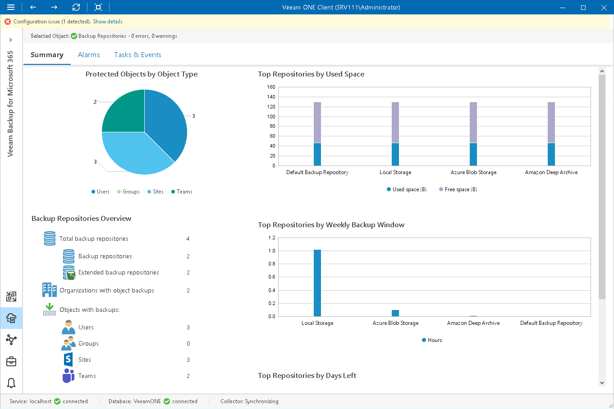
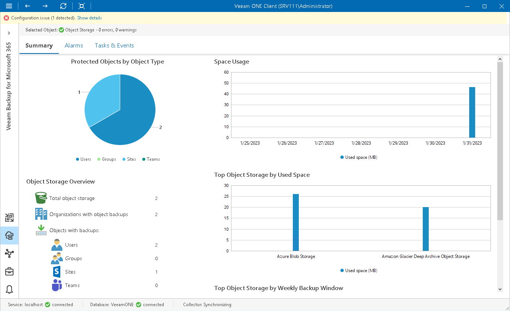

# Veeam Backup for Microsoft 365 Repositories Overview

The summary dashboard for the Repositories node provides a configuration overview and performance analysis for [backup repositories](#backup) and [object storage](#storage) extents managed by Veeam Backup for Microsoft 365 server.

Backup Repositories

Protected Objects by Object Type

The chart displays types of objects protected with Veeam Backup for Microsoft 365 jobs and policies.

Every chart segment shows the number of objects of a specific type — the number of protected Users, Groups, Sites or Teams.

Backup Repositories Overview

The section provides the following details:

* Total number of repositories managed by Veeam Backup for Microsoft 365 server
* Number of backup repositories and repositories extended with object storage
* Number of organizations with object backups that reside on backup repositories
* Number of Users, Groups, Sites and Teams backups that reside on backup repositories

Top Repositories by Used Space

The chart shows backup repositories with the greatest amount of used storage space.

For every repository in the chart, you can see the amount of storage space used by Microsoft 365 object backups against the amount of available space. If free space on the repository is running low, you may need to free up storage space on the repository or revise your backup retention policy.

To display object storage data in this widget, you must first set the capacity limit for these repositories in your Veeam Backup for Microsoft 365 configuration. To do this, select the Limit object storage consumption to check box and specify the limit value in GB, TB or PB. For details on see [Adding Object Storage Repositories](https://helpcenter.veeam.com/docs/vbo365/guide/adding_object_storage.html).

Top Repositories by Weekly Backup Window

The chart allows you to detect the most ‘busy’ repositories over the past 7 days.

For every repository, the chart shows the cumulative amount of time that the repository was busy with backup job tasks.

Top Repositories by Days Left

The chart shows backup repositories that can run low on storage space sooner than others.

To draw the chart, Veeam ONE analyzes historical data and checks how fast free space on repositories has been decreasing in the past. Veeam ONE uses historical statistics to forecast how soon the repository will run out of space.

To display object storage data in this widget, you must first set the capacity limit for these repositories in your Veeam Backup for Microsoft 365 configuration. To do this, select the Limit object storage consumption to check box and specify the limit value in GB, TB or PB. For details on see [Adding Object Storage Repositories](https://helpcenter.veeam.com/docs/vbo365/guide/adding_object_storage.html).

Object Storage

Protected Objects by Object Type

The chart displays types of objects protected with Veeam Backup for Microsoft 365 jobs and policies.

Every chart segment shows the number of objects of a specific type — the number of protected Users, Groups, Sites or Teams.

Object Storage Overview

The section provides the following details:

* Total number of object storage extents
* Number of organizations with object backups that reside on object storage extents
* Number of Users, Groups, Sites and Teams backups that reside on object storage extents

Space Usage

The chart shows the amount of used storage space in object storage.

If free space in the object storage is running low, you may need to free up storage space, revise your backup retention policy, or consider pointing jobs to another repository.

Top Object Storage by Used Space

The chart shows object storage extents with the greatest amount of used storage space.

For every object storage in the chart, you can see the amount of storage space used by Microsoft 365 object backups. If free space in the object storage is running low, you may need to free up storage space or revise your backup retention policy.

Top Object Storage by Weekly Backup Window

The chart allows you to detect the most ‘busy’ object storage extents over the past 7 days.

For every repository, the chart shows the cumulative amount of time that the repository was busy with backup job tasks.

