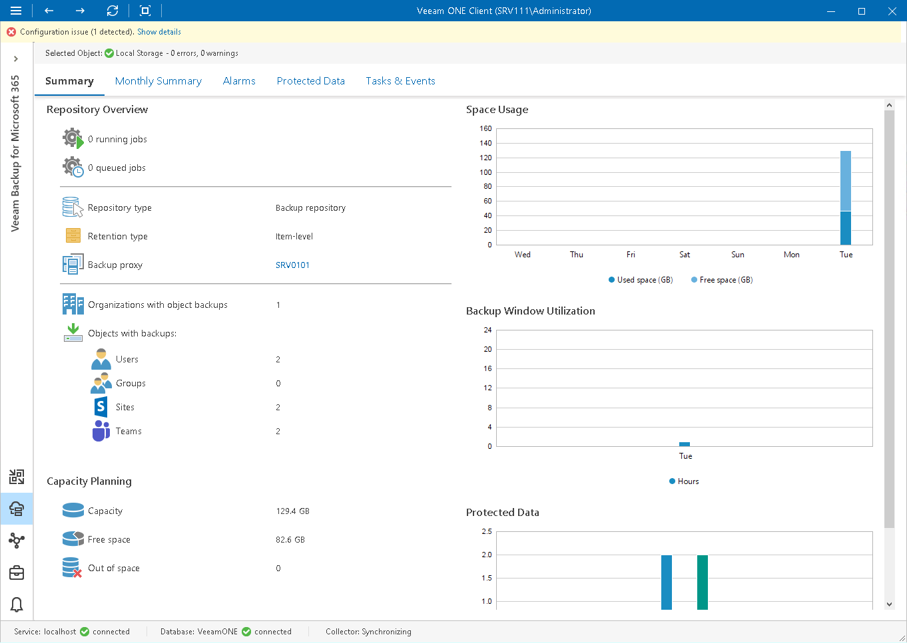
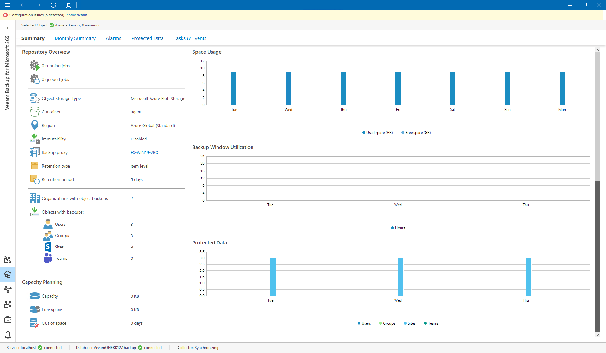

# Veeam Backup for Microsoft 365 Repository Summary

Veeam ONE Client offers the following types of summary dashboards for [backup repositories](#backup) and [object storage](#storage) extents managed by Veeam Backup for Microsoft 365 server.

Backup Repository

The backup repository summary dashboard provides overview details, capacity planning information and performance analysis for a chosen backup repository for the last week or month.

Repository Overview

The section provides the following details:

* Number of jobs that are currently running and queued on the repository
* Repository type: Backup repository
* Backup proxy that processes jobs targeted to the repository
* Type of retention configured in the repository settings

* Number of organizations with object backups that reside on the repository
* Number of Users, Groups, Sites and Teams backups that reside on the repository

Capacity Planning

The section provides the following details:

* Storage capacity of the repository
* Amount of free space on the repository
* Number of days before the repository runs out of free space

To forecast the value, Veeam ONE uses a trend that is calculated based on historical statistics — it analyzes how fast the amount of free space on the repository was decreasing in the past and uses historical statistics to forecast how soon the repository will run out of space.

To display object storage data in this widget, you must first set the capacity limit for these repositories in your Veeam Backup for Microsoft 365 configuration. To do this, select the Limit object storage consumption to check box and specify the limit value in GB, TB or PB. For details on see [Adding Object Storage Repositories](https://helpcenter.veeam.com/docs/vbo365/guide/adding_object_storage.html).

Space Usage

The chart shows the amount of used storage space on the repository.

If free space on the repository is running low, you may need to free up storage space, revise your backup retention policy, or consider pointing jobs to another repository.

To display object storage data in this widget, you must first set the capacity limit for these repositories in your Veeam Backup for Microsoft 365 configuration. To do this, select the Limit object storage consumption to check box and specify the limit value in GB, TB or PB. For details on see [Adding Object Storage Repositories](https://helpcenter.veeam.com/docs/vbo365/guide/adding_object_storage.html).

Backup Window Utilization

The chart shows the cumulative amount of time that the repository was busy with backup job tasks during the past week or month.

The chart can help you reveal possible resource bottlenecks on the repository side. If the backup window on the chart is abnormally large, this may evidence that the required I/O operations cannot complete fast enough, and your target is presenting a bottleneck for the whole backup data processing conveyor. To identify performance bottlenecks, you can switch to repository [Veeam Backup for Microsoft 365 Performance Charts](vbo_charts.md).

Protected Data

The chart shows the number of Microsoft 365 objects (Users, Groups, Sites, Teams) whose data was backed up to the repository during the past week or month.

Object Storage

The object storage summary dashboard provides overview details, capacity planning information and performance analysis for a chosen object storage repository for the last week or month.

Repository Overview

The section provides the following details depending on the repository type:

* Number of jobs that are currently running and queued on the object storage

* Object storage type
* Name of bucket or container
* Region at which the storage is located

* Immutability feature state (Enabled, Disabled, N/A)
* Governance mode (Enabled, Disabled, N/A)

* Backup proxy that processes jobs targeted to the repository
* Retention type configured in the object storage settings

* Retention period
* Connected object storage

* Storage consumption limit (Enabled, Disabled, N/A)

* Class of the infrequent access storage

* Number of organizations with object backups that reside on the repository
* Number of Users, Groups, Sites and Teams backups that reside on the repository

Capacity Planning

The section provides the following details:

* Amount of used space in the object storage
* Number of days before the object storage runs out of free space

To forecast the value, Veeam ONE uses a trend that is calculated based on historical statistics — it analyzes how fast the amount of used space in the object storage was increasing in the past and uses historical statistics to forecast how soon the object storage will run out of space.

Space Usage

The chart shows the amount of used space in the object storage.

If free space in the object storage is running low, you may need to free up storage space, revise your backup retention policy, or consider pointing jobs to another repository.

Backup Window Utilization

The chart shows the cumulative amount of time that the object storage was busy with backup job tasks during the past week or month.

The chart can help you reveal possible resource bottlenecks on the object storage side. If the backup window on the chart is abnormally large, this may evidence that the required I/O operations cannot complete fast enough, and your target is presenting a bottleneck for the whole backup data processing conveyor.

Protected Data

The chart shows the number of Microsoft 365 objects (Users, Groups, Sites, Teams) whose data was backed up to the repository during the past week or month.

