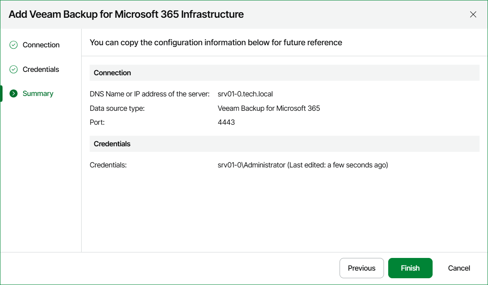

# Step 5. Review Connection Settings

At the Summary step of the wizard, review the connection details and click Finish.

Keep in mind that it may take a while for Veeam ONE to collect and display configuration and performance data for the newly added Veeam Backup for Microsoft 365 server and managed backup infrastructure components. The approximate collection rate is around 600 000 protected Microsoft 365 objects per hour.

