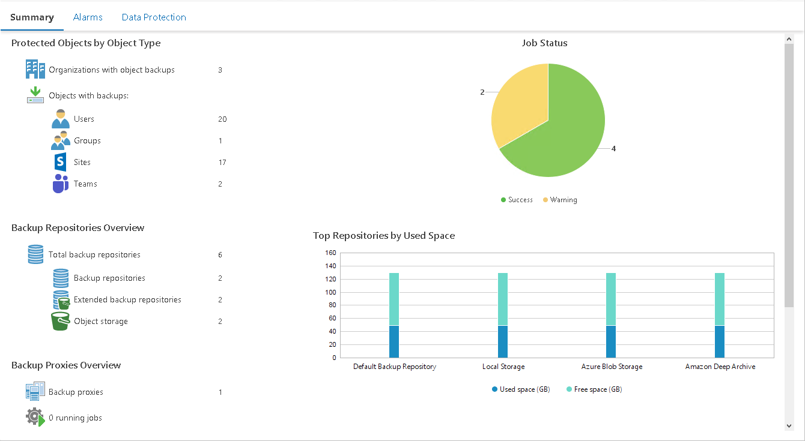

# Veeam Backup for Microsoft 365 Infrastructure Summary

The Veeam Backup for Microsoft 365 infrastructure summary dashboard shows the latest state of data protection operations and indicates the most intensively used resources in the infrastructure.

The dashboard is available for the following nodes:

* Veeam Backup for Microsoft 365 Infrastructure
* Veeam Backup for Microsoft 365 server

Protected Objects by Object Type

The section provides the following details:

* Number of organizations with object backups
* Number of objects (Users, Groups, Sites, Teams) with backups

Job Status

The charts reflect the latest status of Veeam Backup for Microsoft 365 protection jobs for the selected level of the infrastructure hierarchy.

Every chart segment shows how many jobs ended with a specific status — failed jobs (red), jobs that ended with warnings (yellow), successfully performed jobs (green), and jobs that are currently running (blue). Click the necessary chart segment or a legend label to drill down to the list of jobs that ended up with the corresponding status.

Backup Repositories Overview

The section provides the following details:

* Total number of backup repositories for the selected infrastructure node
* Number of repositories extended with an object storage
* Number of object storage repositories

Backup Proxies Overview

The section provides the following details:

* Number of proxies for the selected infrastructure node
* Number of jobs that the proxies are currently processing
* Number of jobs queued for processing

Top Repositories by Used Space

The chart shows 5 backup repositories with the greatest amount of used storage space.

For every repository in the chart, you can track the amount of used storage space against the amount of available space. If free space on the repository is running low, you may need to free up storage space, revise your backup retention policy or even move your backups from the repository and point backup jobs to a new location.

To display object storage data in this widget, you must first set the capacity limit for these repositories in your Veeam Backup for Microsoft 365 configuration. To do this, select the Limit object storage consumption to check box and specify the limit value in GB, TB or PB. For details on see [Adding Object Storage Repositories](https://helpcenter.veeam.com/docs/vbo365/guide/adding_object_storage.html).

Top Backup Proxies by Weekly Transferred Data

The chart shows 5 backup proxies that processed the greatest amount of data over the past 7 days.

To draw the chart, Veeam ONE analyzes how many object processing tasks were successfully performed by every proxy; failed tasks are not taken into account.

The chart helps you detect the most heavily loaded proxies and optimize the performance of your backup infrastructure. If specific proxies are overloaded with processing tasks, and the jobs often need to wait for proxy resources, you may need to deploy additional proxies or balance the processing load by assigning jobs to other proxies.

