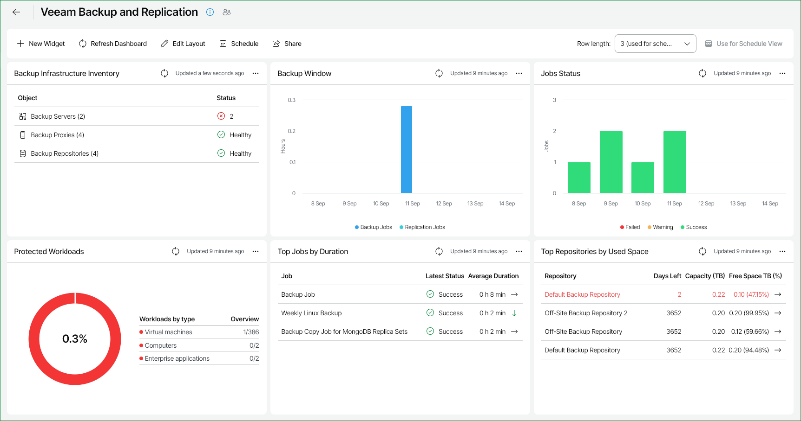

# Veeam Backup & Replication Dashboard

The Veeam Backup & Replication dashboard provides information on the state of the key backup infrastructure components. The built-in widgets display a list of important events and help focus on the core efficiency indicators.

You can access the Veeam Backup & Replication dashboard from the Dashboard tab in Veeam ONE Web Client.

Widgets Included

Backup Infrastructure Inventory

This widget describes your backup infrastructure inventory and shows how many backup components of each type are deployed. The widget reflects the health state of backup infrastructure and displays healthy objects (green), objects with warnings (yellow), objects with errors (red).

Best Practices Findings

This widget displays the status of security and compliance checks for each backup server. The widget displays healthy for all checks passed (green), warning for Unable to detect (yellow), error for Not implemented (red), and other for Not checked or Suppressed (gray). This provides a quick overview of your backup infrastructure's compliance and health.

Backup Window

This widget shows the total duration of daily backup and replication job sessions. It allows you to track the efficiency of backup jobs, to detect issues occurred in the backup process and to check whether jobs completed within the prescribed backup window.

Jobs Status

This widget provides information on the completion state of scheduled backup and replication jobs. It displays a daily summary of successfully completed jobs, and shows the number of jobs that completed with warnings and errors during the past week.

The widget helps you assess the efficiency of your data protection operations.

Protected VMs Overview

This widget displays information on VMware vSphere and Microsoft Hyper-V VMs protected with backup and replication jobs, specifically:

* Protected VMs — the total number of VMs protected with backups or replicas.
* Backed Up VMs — the total number of VMs for which backups are available.
* Replicated VMs — the total number of VMs for which replicas are available.
* Unprotected VMs — the total number of VMs not protected with backups or replicas.
* Restore Points — the total number of available restore points for protected VMs.
* Full Backups Size — the amount of storage space consumed by full backups.
* Increments Size — the amount of storage space consumed by incremental backups.
* Source VMs Size — the total size of storage space consumed by source VMs on production storage.
* Successful VMs Backup Ratio — the percentage of latest backup and replication sessions that completed successfully over the previous week against the total number of latest sessions for protected VMs.

Protected Workloads

This widget displays information on all protected workloads in your infrastructure: VMs (VMware, Hyper-V, AHV, Proxmox VE, KVM), Computers, Cloud instances, Enterprise Applications, Unstructured Data.

Top Jobs by Duration

This widget displays top 5 jobs in terms of the longest duration, job completion status and the value of the average weekly duration. The widget helps you assess the backup infrastructure health and efficiency.

Arrows on the right show how job duration has changed over the previous week\*.

Top Repositories by Used Space

This widget displays 5 repositories that will run out of free space sooner than other repositories, as well as total capacity and free space left on these repositories. The widget also forecasts how many days remain before the repositories will run out of free space.

Arrows on the right show how the repository free space value has changed over the previous week\*.

|  |
| --- |
| Note: |
| * Veeam ONE Web Client displays file backup copy jobs together with other backup copy jobs. * Veeam ONE Web Client displays CDP Proxy servers together with other proxy servers.  * Infrastructure topology view in Veeam ONE and Veeam Backup & Replication must match. Otherwise, Veeam ONE Web Client may show invalid data for Veeam Backup & Replication reports and dashboards. |

\*The arrows allow you to compare the results of this week to the results of the previous week and to track how the trend has evolved. For example, a grey arrow pointing right next to the Duration value means that duration of the job has not changed over the past week, a green arrow pointing down means that job duration has decreased, while a red arrow pointing up means that job duration has increased.

