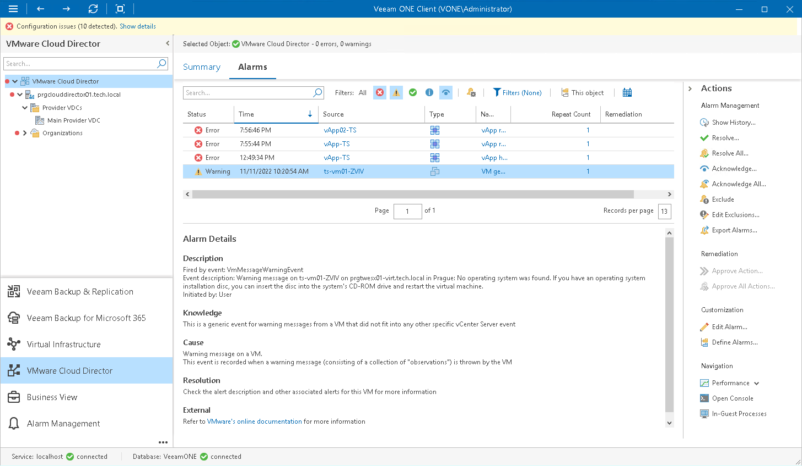

# VMware Cloud Director Alarms

Veeam ONE includes a set of alarms for monitoring VMware Cloud Director health status and resource usage. Predefined VMware Cloud Director alarms are configured to warn you about events or issues that can cause disruptions in cloud service availability:

* Expiring runtime and storage leases for customers' vApps
* Pending blocking tasks left without timely response
* Breached thresholds for compute, storage and network resource utilization at various layers of the VMware Cloud Director infrastructure
* Changes in health status of VMware Cloud Director components

To view the list of alarms for VMware Cloud Director infrastructure:

1. Open Veeam ONE Client.

For details, see [Accessing Veeam ONE Components](access.md).

1. At the bottom of the inventory pane, click VMware Cloud Director.
2. In the inventory pane, select the necessary infrastructure node.
3. Open the Alarms tab.

In addition to Cloud Director-specific alarms, the dashboard displays alarms triggered for VMware vSphere infrastructure components. Thus you can monitor both the logical cloud layer and the state of underlying VMware vSphere infrastructure components.

For details on alarms, see [Working with Triggered Alarms](triggered_alarms.md).

