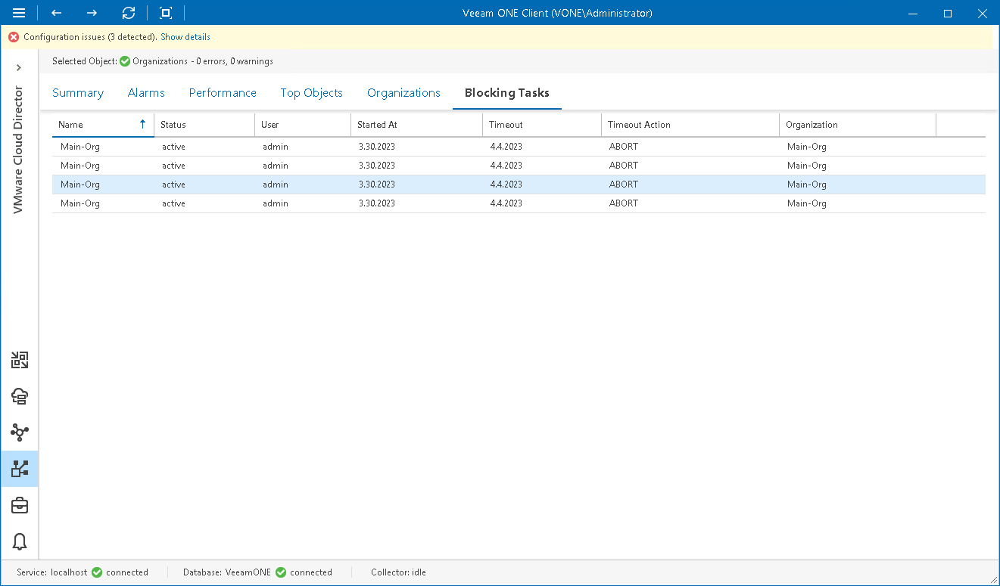

# Tracking Blocking Tasks

You can track pending blocking task requests for a specific organization or all organizations at once:

1. Open Veeam ONE Client.

For details, see [Accessing Veeam ONE Components](access.md).

1. At the bottom of the inventory pane, click VMware Cloud Director.
2. In the inventory pane, select an organization node to view blocking tasks pending for this organization.

Select the Organizations node to view blocking tasks pending for all organizations within this VMware Cloud Director cell.

1. Open the Blocking Tasks tab.

For every blocking task in the list, the following details are shown:

* Name — name of the organization
* Status — current status of the blocking task
* User — name of the user who initiated the task
* Started At — date and time when the task was initiated
* Timeout — default timeout set for blocking tasks
* Timeout Action — the action that will be triggered upon the task after the timeout expires
* Organization — name of the organization

