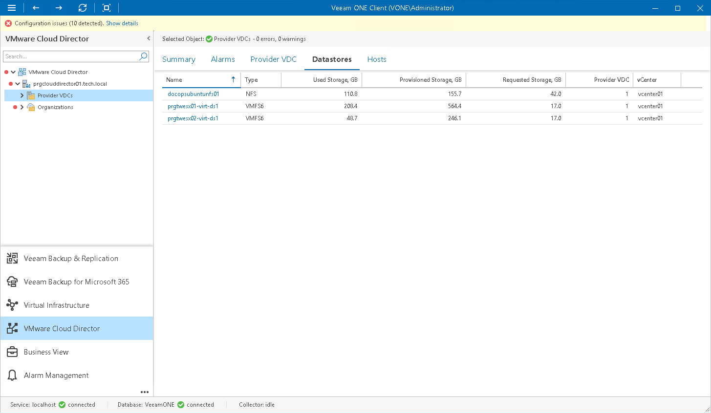

# Datastore Resources

You can view a list of datastores attached to provider virtual datacenters:

1. Open Veeam ONE Client.

For details, see [Accessing Veeam ONE Components](access.md).

1. At the bottom of the inventory pane, click VMware Cloud Director.
2. In the inventory pane, select a provider VDC node to view datastores attached to this provider VDC. Select the Provider VDCs node to view datastores attached to all provider VDCs within the VMware Cloud Director cell.
3. Open the Datastores tab.

For every datastore in the list, the following details are shown:

* Name — name of the datastore (you can click the name to switch to the [summary dashboard for the datastore](vsphere_datastore_summary.md))
* Type — datastore file system (VMFS or NFS)
* Used Storage, GB — amount of storage resources currently consumed on the datastore
* Provisioned Storage, GB — amount of space provisioned to VMs. If VMs are created using thin provisioning, some of the provisioned space might not be used
* Requested Storage, GB — amount of provisioned storage used by Cloud Director-managed objects. If thin provisioning is enabled on Cloud Director, some of the requested space might not be used
* Provider VDC — number of provider VDCs to which the datastore is attached
* vCenter — name of the vCenter Server that manages the datastore

