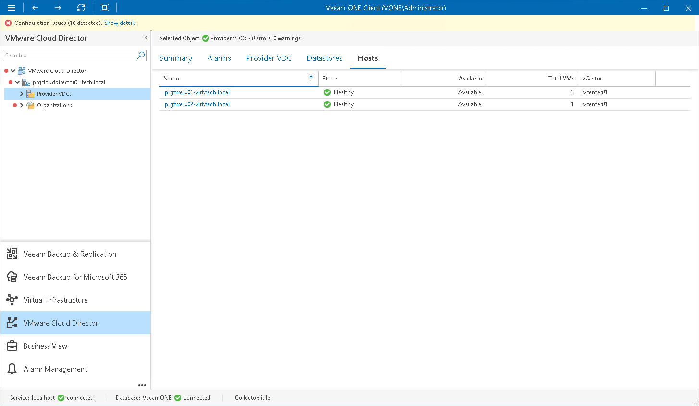

# Host Resources

You can view a list of hosts that are backing a provider virtual datacenter:

1. Open Veeam ONE Client.

For details, see [Accessing Veeam ONE Components](access.md).

1. At the bottom of the inventory pane, click VMware Cloud Director.
2. In the inventory pane, select a provider VDC node.
3. Open the Hosts tab.

For every host in the list, the following details are shown:

* Name — name of the host (you can click the name to switch to the [summary dashboard for the host](vsphere_host_summary.md))
* Status — health status of the host (Healthy, Warning or Error)
* Available — flag indicating whether the host is available to VMware Cloud Director
* Total VMs — number of VMs currently registered on the host
* vCenter — name of the vCenter Server that manages the host

