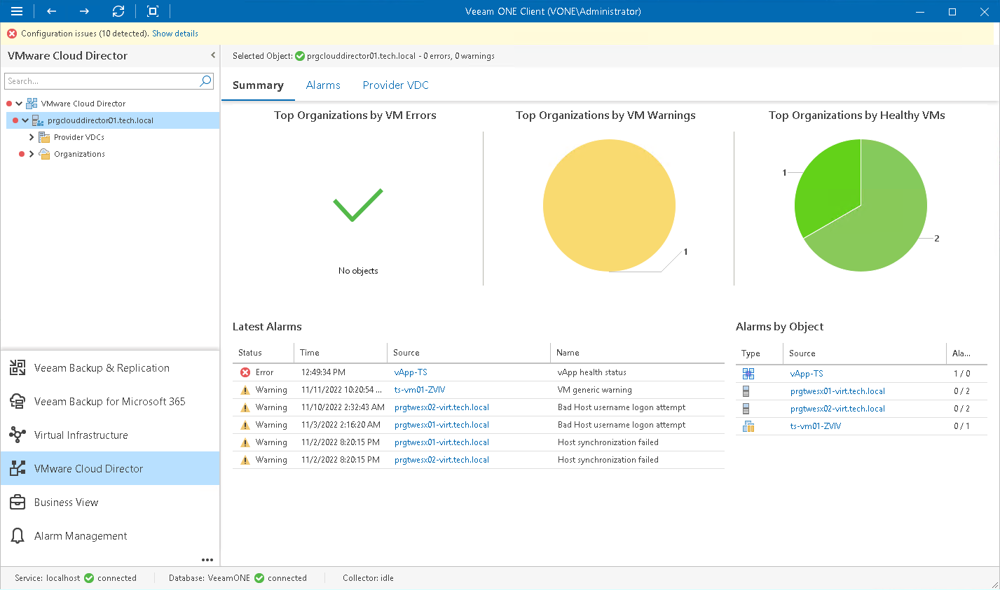

# VMware Cloud Director Infrastructure Summary

The VMware Cloud Director infrastructure summary dashboard provides the health status overview for all organizations and child VMware Cloud Director objects.

The dashboard is available for the following infrastructure levels:

* VMware Cloud Director Infrastructure (root node)
* VMware Cloud Director cell

Top Organizations by VM Errors, Top Organizations by VM Warnings, Top Organizations by Healthy VMs

The charts represent organizations with the greatest number of errors, warnings and organizations with no registered alarms. Click a chart segment or a legend label to drill down to the list of alarms with the corresponding status for the selected organization.

Latest Alarms

The list displays the latest 15 alarms for the selected VMware Cloud Director segment. Click a link in the Source column to drill down to the list of alarms triggered for a specific VMware Cloud Director infrastructure object.

Alarms by Object

The list displays 15 objects with the greatest number of alarms.

The value in the Alarms column shows the number of errors and warnings for an object. For example, 3/1 means that there are 3 error alarms and 1 warning alarm triggered for the object. Click a link in the Source column to drill down to the list of alarms related to a specific VMware Cloud Director infrastructure object.

For details on alarms, see [Working with Triggered Alarms](triggered_alarms.md).

