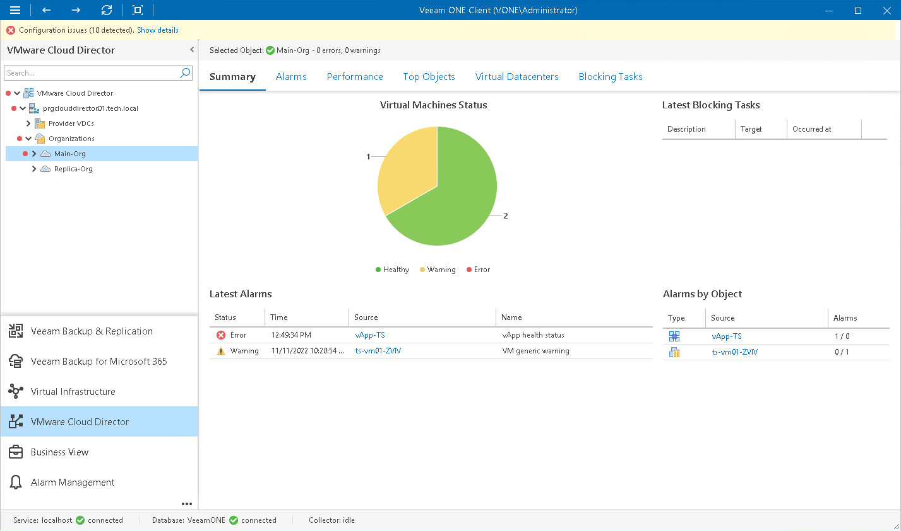

# Organization Summary

The organization summary dashboard presents the health status overview for the chosen organization and its child objects.

Virtual Machines by State

The chart reflects the summary health status of VMs in the organization.

Every colored segment represents the number of VMs in a certain state — VMs with errors (red), VMs with warnings (yellow) and healthy VMs (green). Click the chart segment or a legend label to drill down to the list of alarms triggered for organization VMs with the chosen health status.

Latest Blocking Tasks

The list displays the latest 15 suspended operations that require approval before the operation will resume.

For each pending operation, Veeam ONE Client provides a description, the organization for which the operation was initiated and the time when the operation was initiated by an organization user. Blocking tasks that expired with timeout are not included in the list.

Latest Alarms

The list displays the latest 15 alarms for the organizations, organization VDCs, as well as for VMs and vApps within these organizations. Click a link in the Source column to drill down to the list of alarms triggered for a specific object.

Alarms by Object

The list displays 15 objects with the greatest number of alarms.

The value in the Alarms column shows the number of errors and warnings for an object. For example, 3/1 means that there are 3 error alarms and 1 warning alarm triggered for the object. Click a link in the Source column to drill down to the list of alarms related to a specific object.

For details on alarms, see [Working with Triggered Alarms](triggered_alarms.md).

Page updated 2026-07-31

