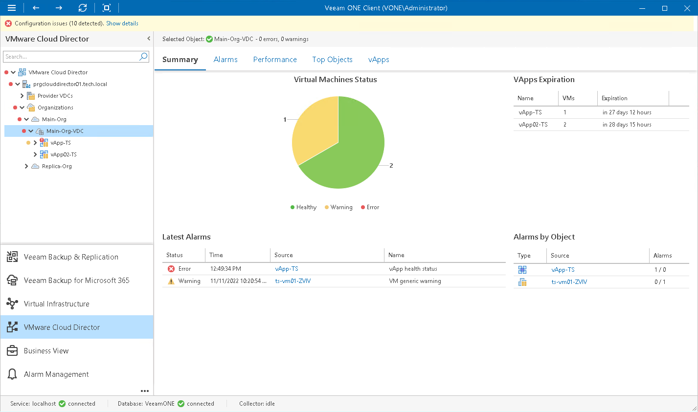

# Organization VDC Summary

The organization VDC summary dashboard presents resource utilization analysis and the health status overview for the chosen organization virtual datacenter.

Virtual Machines by State

The chart reflects the summary health status of VMs in the organization virtual datacenter.

Every colored segment represents the number of VMs in a certain state — VMs with errors (red), VMs with warnings (yellow) and healthy VMs (green). Click a chart segment or legend label to drill down to the list of alarms triggered for VMs with the chosen health status.

VApps Expiration

The list displays vApps whose runtime lease or storage lease has expired. The list shows 15 items with the recently expired lease, and is only populated if the storage lease cleanup policy for the organization is set to Move to Expired Items.

Latest Alarms

The list displays the latest 15 alarms for the organization VDC and its child objects (vApps and VMs). Click a link in the Source column to drill down to the list of alarms triggered for a specific object.

Alarms by Object

The list displays 15 objects with the greatest number of alarms.

The value in the Alarms column shows the number of errors and warnings for an object. For example, 3/1 means that there are 3 error alarms and 1 warning alarm triggered for the object. Click a link in the Source column to drill down to the list of alarms related to a specific object.

For details on alarms, see [Working with Triggered Alarms](triggered_alarms.md).

