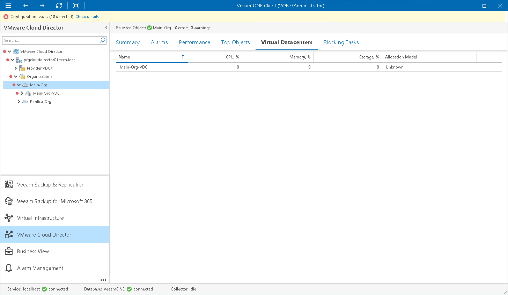

# Organization VDCs

You can view a list of VDCs configured for a specific organization:

1. Open Veeam ONE Client.

For details, see [Accessing Veeam ONE Components](access.md).

1. At the bottom of the inventory pane, click VMware Cloud Director.
2. In the inventory pane, select an organization node.
3. Open the Virtual Datacenters tab.

For every virtual datacenter in the list, the following details are shown:

* Name — name of the organization VDC
* CPU, % — amount of CPU resources currently used by the organization (as a percentage of resources allocated to the organization within this virtual datacenter)
* Memory, % — amount of memory resources currently used by the organization (as a percentage of resources allocated to the organization within this virtual datacenter)
* Storage, % — amount of storage resources currently used by the organization (as a percentage of resources allocated to the organization within this virtual datacenter)
* Allocation Model — allocation model for the virtual datacenter (Allocation Pool, Reservation Pool, Pay-as-you-go, Flex)

