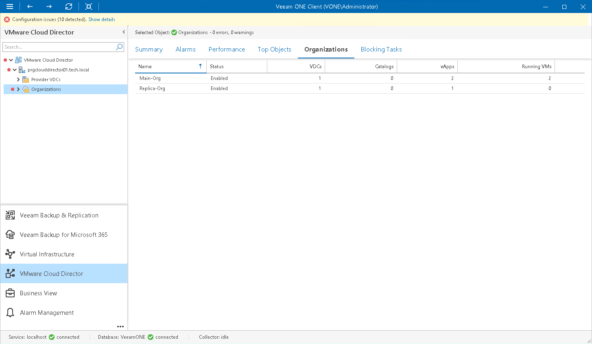

# Organizations

You can view a list of organizations within the VMware Cloud Director cell:

1. Open Veeam ONE Client.

For details, see [Accessing Veeam ONE Components](access.md).

1. At the bottom of the inventory pane, click VMware Cloud Director.
2. In the inventory pane, select the Organizations node.
3. Open the Organizations tab.

For every organization in the list, the following details are shown:

* Name — name of the organization
* Status — status of the organization indicating whether the organization is enabled (that is, users can log in to the organization and the current user sessions can run)
* VDCs — number of virtual datacenters configured for the organization
* Catalogs — number of organization's catalogs, both shared and non-shared
* vApps — number of vApps configured for the organization (including expired vApps)
* Running VMs — number of VMs currently running within this organization

