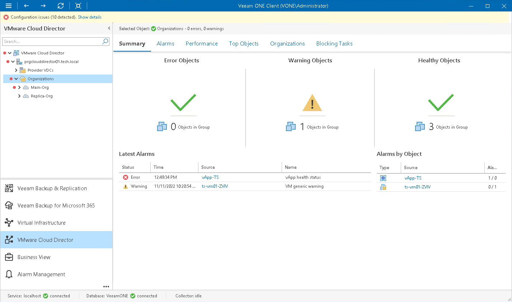

# Organizations Overview

The summary dashboard for the Organizations node provides an overview for organizations under the selected VMware Cloud Director cell.

Error Objects, Warning Objects, Healthy Objects

The charts group VMs in organizations by their health status.

Every chart reflects the number of organization VMs with a specific state — VMs with errors (red), VMs with warnings (yellow) and healthy VMs (green). Click the problematic chart to drill down to the list of alarms for VMs with the chosen health status.

Latest Alarms

The list displays the latest 15 alarms that were triggered for organizations, organization VDCs, as well as for VMs and vApps within these organizations. Click a link in the Source column to drill down to the list of alarms triggered for a specific object.

Alarms by Object

The list displays 15 objects with the greatest number of alarms.

The value in the Alarms column shows the number of errors and warnings for an object. For example, 3/1 means that there are 3 error alarms and 1 warning alarm triggered for the object. Click a link in the Source column to drill down to the list of alarms related to a specific object.

For details on alarms, see [Working with Triggered Alarms](triggered_alarms.md).

