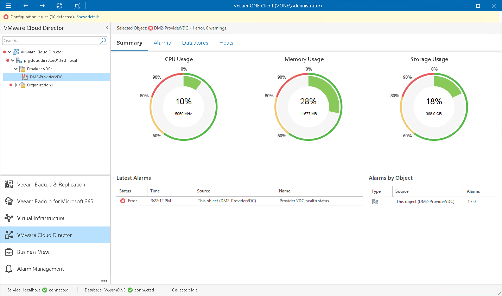

# Provider VDC Summary

The provider VDC summary dashboard reflects resource utilization analysis results and the health status overview for the chosen provider virtual datacenter and VMware vSphere resources.

CPU Usage, Memory Usage, Storage Usage

The charts reflect the amount of currently consumed CPU, memory and storage resources for the chosen provider virtual datacenter.

Latest Alarms

The list displays the latest 15 alarms for the provider VDC and underlying virtual infrastructure objects (datastores and hosts). Click a link in the Source column to drill down to the list of alarms triggered for a specific object.

Alarms by Object

The section displays the current state of hosts and datastores that provide compute and storage resources for the provider VDC. Information in this section may help you estimate the impact of underlying VMware vSphere objects on the provider VDC and speed up root cause analysis.

The value in the Alarms column shows the number of errors and warnings for an object. For example, 3/1 means that there are 3 error alarms and 1 warning alarm triggered for the object. Click a link in the Source column to drill down to the list of alarms related to a specific object.

For details on alarms, see [Working with Triggered Alarms](triggered_alarms.md).

