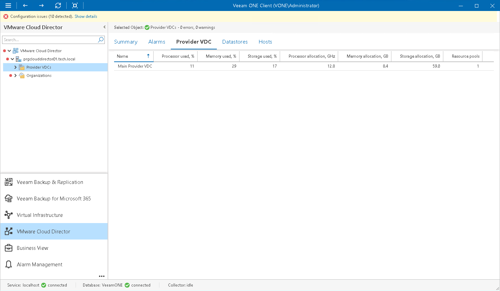

# Provider VDCs

You can view a list of provider virtual datacenters configured within a Cloud Director cell:

1. Open Veeam ONE Client.

For details, see [Accessing Veeam ONE Components](access.md).

1. At the bottom of the inventory pane, click VMware Cloud Director.
2. In the inventory pane, select a VMware Cloud Director cell or the Provider VDCs node.
3. Open the Provider VDC tab.

For every provider VDC in the list, the following details are shown:

* Name — name of the provider virtual datacenter
* Processor used, % — amount of provider VDC CPU resources that is currently used by organizations
* Memory used, % — amount of provider VDC memory resources that is currently used by organizations
* Storage used, % — amount of provider VDC storage resources that is currently used by organizations
* Processor allocation, GHz — amount of provider VDC CPU resources that is committed to organization VDCs
* Memory allocation, GB — amount of provider VDC memory resources that is committed to organization VDCs
* Storage allocation, GB — amount of provider VDC storage resources that is committed to organization VDCs
* Resource pools — number of resource pools that are backing compute resources of the provider VDC

You can click column names to sort provider VDCs by a specific parameter. For example, to identify what provider VDCs are running out of storage resources, you can sort provider VDCs in the list by Storage used, %.

