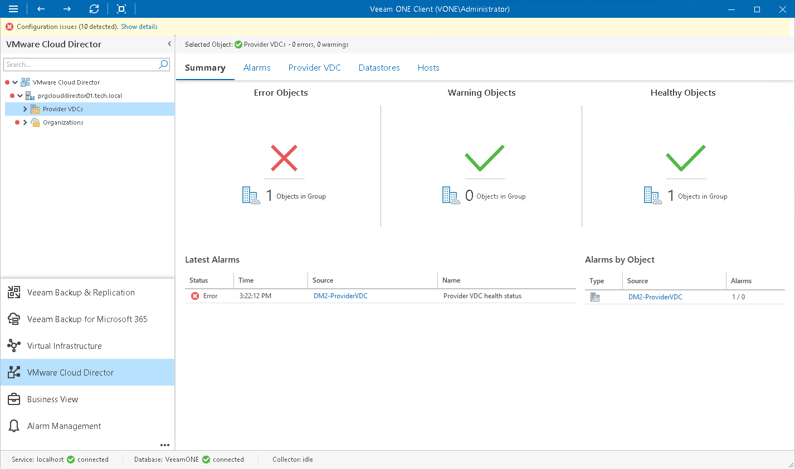

# Provider VDCs Overview

The summary dashboard for the Provider VDCs node displays the health status overview for provider virtual datacenters under a VMware Cloud Director cell.

Error Objects, Warning Objects, Healthy Objects

The charts group provider VDCs by their health status.

Every chart reflects the number of provider VDCs with a specific state — provider VDCs with errors (red), provider VDCs with warnings (yellow) and healthy provider VDCs (green). Click the problematic chart to drill down to the list of alarms for VDCs with the chosen health status.

Latest Alarms

The list displays the latest 15 alarms that were triggered for provider VDCs and underlying virtual infrastructure objects (datastores and hosts). Click a link in the Source column to drill down to the list of alarms triggered for a specific object.

Alarms by Object

The list displays 15 objects with the greatest number of alarms.

The value in the Alarms column shows the number of errors and warnings for an object. For example, 3/1 means that there are 3 error alarms and 1 warning alarm triggered for the object. Click a link in the Source column to drill down to the list of alarms related to a specific object.

For details on alarms, see [Working with Triggered Alarms](triggered_alarms.md).

