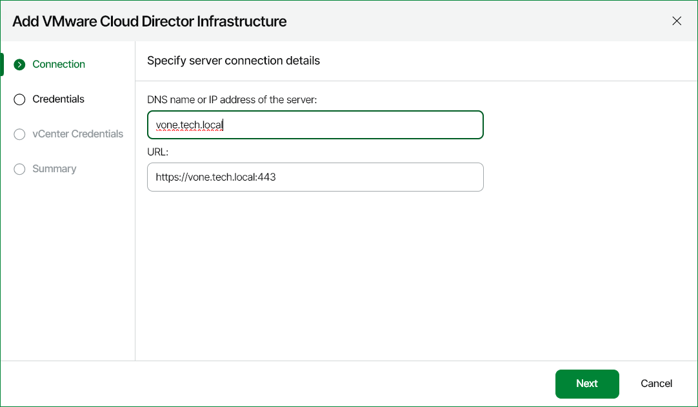

# Step 3. Specify Server Name

At the Connection step of the wizard:

1. Enter DNS or IP address of the VMware Cloud Director server that you want to connect.
2. Change VMware Cloud Director URL if required.

Veeam ONE populates the URL field with a URL used for connecting to the VMware Cloud Director server. The URL format is https://<vcdservername>:443, where <vcdservername> is the DNS name or IP address of the VMware Cloud Director server, and 443 is the default port. If you use port number other than 443, you can change it in the URL field.

