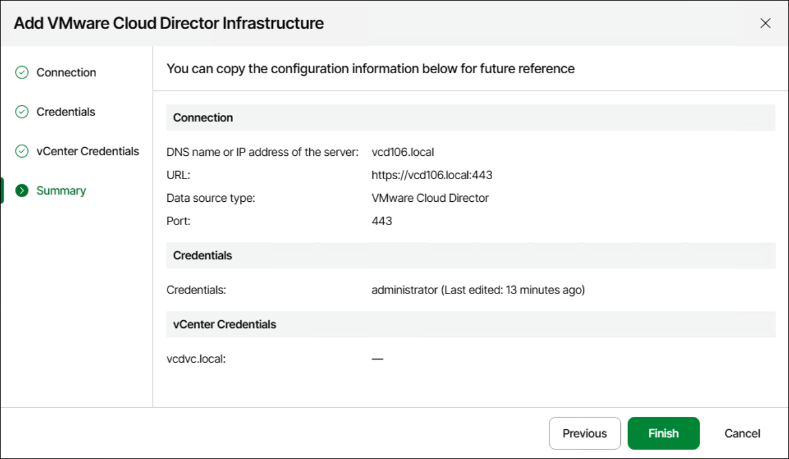

# Step 6. Review Connection Settings

At the Summary step of the wizard, review the connection details and click Finish.

The VMware Cloud Director hierarchy will become available in the VMware Cloud Director view. Note that it may take a while for Veeam ONE to collect and display data for the newly added VMware Cloud Director and its child objects.

When you connect VMware Cloud Director, Veeam ONE also connects underlying vCenter Servers and initiates data import. vCenter Servers become available on the Data Collection Overview page and in the Infrastructure View, and you can work with them as with regular VMware vSphere infrastructure servers. If the vCenter Server attached to VMware Cloud Director is already connected, Veeam ONE will only create an association between the VMware Cloud Director hierarchy and the vCenter Server.

