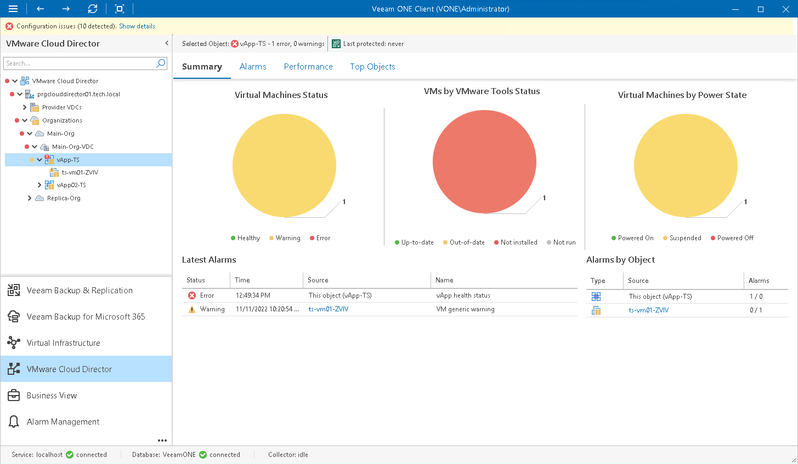

# vApp Summary

The vApp summary dashboard provides a health status overview for the chosen vApp and VMs in this vApp.

Virtual Machines by State

The chart groups VMs in the vApp by health status.

Every colored segment represents the number of VMs in a certain state — VMs with errors (red), VMs with warnings (yellow) and healthy VMs (green). Click a chart segment or a legend label to drill down to the list of alarms triggered for VMs with the chosen health status.

VMs by VMware Tools Status

The chart groups VMs in the vApp by VMware Tools status.

Every colored segment reflects the number of VMs with a specific state — VMware Tools not installed (red), VMware Tools need to be updated to the latest version (yellow), VMware Tools up-to-date and running (green) and VMware Tools installed but not running for some reason (grey).

Virtual Machines by Power State

The chart groups VMs in the vApp by power state. Every colored segment reflects the number of VMs with a specific power state — powered off VMs (red), suspended VMs (yellow) and powered on VMs (green).

Latest Alarms

The list displays the latest 15 alarms triggered for the vApp and VMs that belong to it. Click a link in the Source column to drill down to the list of alarms triggered for a specific object.

Alarms by Object

The list displays 15 objects with the greatest number of alarms.

The value in the Alarms column shows the number of errors and warnings for an object. For example, 3/1 means that there are 3 error alarms and 1 warning alarm triggered for the object. Click a link in the Source column to drill down to the list of alarms related to a specific object.

For details on alarms, see [Working with Triggered Alarms](triggered_alarms.md).

