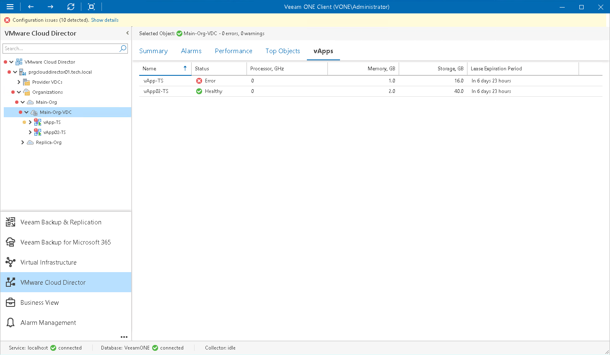

# vApps

You can view a list of virtual applications created within a specific organization VDC:

1. Open Veeam ONE Client.

For details, see [Accessing Veeam ONE Components](access.md).

1. At the bottom of the inventory pane, click VMware Cloud Director.
2. In the inventory pane, select an organization VDC node.
3. Open the vApps tab.

For every vApp in the list, the following details are shown:

* Name — name of the vApp
* Status — health status of the vApp
* Processor, GHz — amount of CPU resources currently consumed by the vApp and all its VMs
* Memory, GB — amount of memory resources currently consumed by the vApp and all its VMs
* Storage, GB — amount of storage resources currently consumed by the vApp and all its VMs
* Lease Expiration Period — amount of time left before the vApp runtime lease expires (for running vApps), or amount of time left before the vApp storage lease expires (for inactive vApps and templates)

