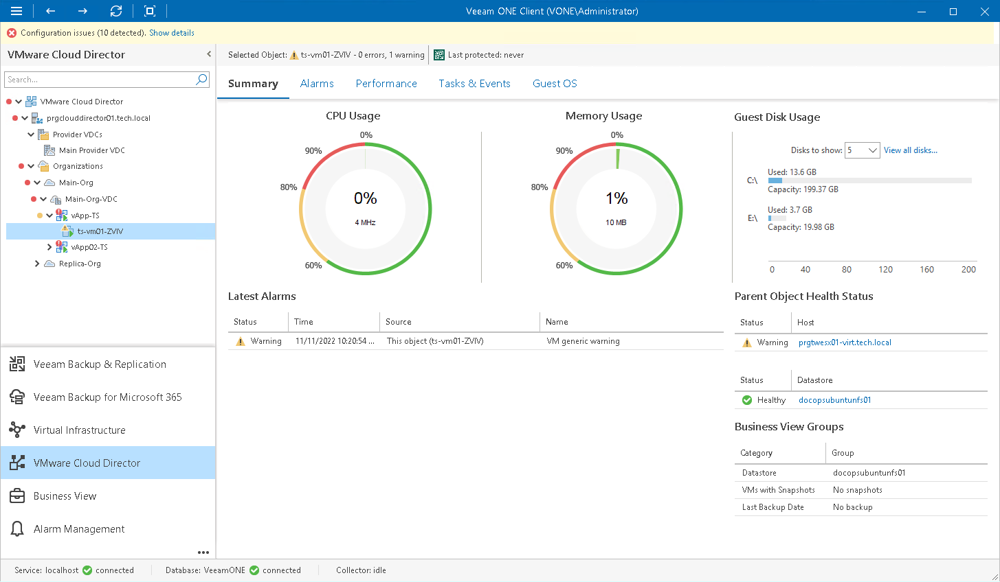

# Virtual Machine Summary

The VM summary dashboard provides the health status and performance overview for the selected VM. In addition, this dashboard shows the state of objects that can affect the VM performance — the parent host and the datastores where VM files are located.

Selected Object

The section at the top of the dashboard shows the VM health status (number of triggered warnings and errors) and the date when the latest backup or replica restore point was created for the VM with Veeam Backup & Replication.

CPU Usage, Memory Usage

The charts display the amount of CPU and memory resources currently consumed by the VM.

Guest Disk Usage

The chart displays the amount of available and used guest disk space with a breakdown by disks. By default, 5 guest disks with the greatest amount of used space are displayed.

Use the Disks to show list to change the number of disks to display on the chart. Click the View all disks link to view details for all guest disks. In the Guests Disks window, you can suppress Guest disk space alarms for specific disks. To suppress alarms for a disk, select the Suppress alarms check boxes next to the disk name.

|  |
| --- |
| Note: |
| Details on the guest disk usage are available only for VMs with VMware Tools installed. |

Latest Alarms

The list displays the latest 15 alarms for the VM.

Parent Object Health Status

The section displays the current state of the host where the VM resides and the state of datastores that host VMs files. Information available in this section may help you estimate how the state of parent objects impacts VM performance. Click the host or datastore link to drill down to the list of alarms for the host or datastore.

For details on alarms, see [Working with Triggered Alarms](triggered_alarms.md).

Business View Groups

The section displays the list of categories and groups to which the VM is included.

