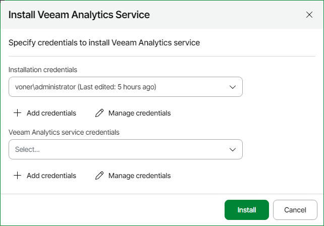
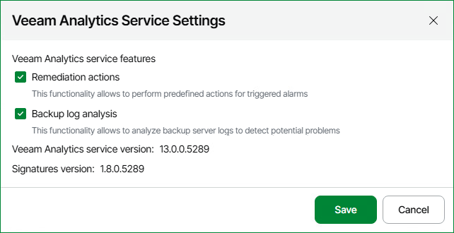

# Veeam Analytics Service

Veeam Analytics service is a component that enables communication with Veeam Backup & Replication servers, collects monitoring and reporting data, and sends remediation commands.

By default, Veeam ONE installs Veeam Analytics service automatically when you connect Veeam Backup & Replication servers. However, you might need to install Veeam Analytics service manually in specific situations. For example, if you did not approve the request for data collection in the Veeam Host Management console or if there was an error during installation.

You can install, configure, repair and monitor Veeam Analytics service on the Veeam Backup & Replication servers that are connected to Veeam ONE.

Considerations and Limitations

Consider the following:

* DNS resolution must work in both directions. Veeam ONE Server should be able to resolve the Veeam Backup & Replication Server using reverse DNS (PTR record), and the Veeam Backup & Replication Server should be able to resolve the FQDN of the Veeam ONE Server.

To edit the Hosts file on Veeam Analytics service, use the Configuration Files Import/Export feature. For details on file import and export, see [Performing Maintenance Tasks](https://helpcenter.veeam.com/docs/vbr/em/hmc_perform_maintenance_tasks.html).

* Veeam Analytics service only collects performance data from the Veeam Backup & Replication server itself. Data from proxies, repositories, or remote hosts is not collected.
* Each Veeam Analytics service is owned by a single Veeam ONE server. If you connect Veeam Backup & Replication server to another Veeam ONE instance, the ownership will be overwritten.
* [For high availability clusters] Veeam Analytics service must be installed on each node in the cluster. Veeam Analytics service is typically installed automatically during setup; however, depending on your cluster configuration, you may need to install it manually (.msi for Windows and .bndl for Linux). When configured, performance data is collected only from the primary node.

* [For Microsoft Windows servers] Veeam Analytics service can be automatically installed on Veeam Backup & Replication servers managed by Enterprise Manager if their credentials match. Otherwise, you must install Veeam Analytics service on such servers in Veeam ONE Web Client or manually.

* [For Linux servers] To install and repair the Veeam Analytics Service package on Linux, you must enable remote data collection in the Veeam Host Management console on Veeam Backup & Replication. For more information, see section [Configuring Backup Infrastructure Settings](https://helpcenter.veeam.com/docs/vbr/userguide/hmc_configure_infrastructure.html?ver=13#enabling-remote-data-collection) of the Veeam Backup & Replication User Guide.

* [For Linux servers] Veeam Analytics service cannot be automatically installed on Veeam Backup & Replication servers managed by Enterprise Manager. You must install Veeam Analytics service on such servers in Veeam ONE Web Client or manually.
* [For Linux servers] When using a user account other than the default veeamadmin, it is recommended to assign the Service Account role in Veeam Host Management and also Backup Administrator permissions in Veeam Backup & Replication. For details on roles and permissions, see [Configuring Users](https://helpcenter.veeam.com/docs/vbr/userguide/hmc_configure_users.html) and [Configuring Roles](https://helpcenter.veeam.com/docs/vbr/userguide/configure_roles.html) in the Veeam Backup & Replication User Guide.

For newly created local users in Veeam Host Management with a role other than Service Account, the user must first log in to the Veeam Software Appliance Web Client to change the password. Otherwise, an error occurs when connecting to the backup server to deploy Veeam Analytics service.

Installing Veeam Analytics Service in Veeam ONE Web Client

To install Veeam Analytics service on Veeam Backup & Replication in Veeam ONE Web Client:

1. Open Veeam ONE Web Client.

For details, see [Accessing Veeam ONE Components](access.md).

1. At the top right corner of the Veeam ONE Web Client screen, click the Configuration icon.
2. In the Data Collection Overview section, select the Veeam Backup & Replication servers on which you want to install Veeam Analytics service.

To find the servers on which Veeam Analytics service is not installed, you can use the Veeam Analytics service state filter at the top of the servers list.

1. In the Veeam Analytics service menu, select Management and click Install.
2. Specify credentials to install Veeam Analytics service.

For details on account permissions, see [Veeam Analytics Service deployment credentials](connection_to_backup_servers.md#agent).

1. [For Microsoft Windows servers] Specify credentials to run Veeam Analytics service.

For details on account permissions, see [Connection to Veeam Backup & Replication Servers](connection_to_backup_servers.md).

1. Click Install.

Installing Veeam Analytics Service on Microsoft Windows Manually

By default, Veeam ONE Web Client installs Veeam Analytics service when you connect Veeam Backup & Replication servers in the Add Server wizard.

To install Veeam Analytics service on Windows manually:

1. Open Veeam ONE Web Client.

For details, see [Accessing Veeam ONE Components](access.md).

1. At the top right corner of the Veeam ONE Web Client screen, click the Configuration icon.
2. Navigate to the Data Collection Overview section.
3. At the top of the servers list, open the Veeam Analytics service drop-down menu and select Download package > Microsoft Windows.

Veeam Analytics service package file will be saved to the default download folder on your local machine.

1. Run the installation package on the machine with Veeam Backup & Replication server and follow the installation wizard instructions.

|  |
| --- |
| Note |
| The Pending acceptance state may appear in the Veeam Analytics service column when the installation of Veeam Analytics service has not yet been approved. To proceed, manually approve the pending connection request to remove this status and complete the installation. |

Installing Veeam Analytics Service on Linux Manually

By default, Veeam ONE Web Client installs Veeam Analytics service when you connect Veeam Backup & Replication servers in the Add Server wizard.

To install Veeam Analytics service on Linux manually:

1. Open Veeam ONE Web Client.

For details, see [Accessing Veeam ONE Components](access.md).

1. At the top right corner of the Veeam ONE Web Client screen, click the Configuration icon.
2. Navigate to the Data Collection Overview section.
3. At the top of the servers list, open the Veeam Analytics service drop-down menu and select Download package > Linux.

Veeam Analytics service package file will be saved to the default download folder on your local machine.

1. Open Veeam Updater.

For details on accessing Veeam Updater on Veeam Backup & Replication server, see section [Installing Private Hotfixes](https://helpcenter.veeam.com/docs/vbr/userguide/update_appliance_install_updates.html?ver=13#installing-private-hotfixes) of the Veeam Backup & Replication User Guide.

1. Click Upload a local file and select the Veeam Analytics service package.
2. Click Upload.

|  |
| --- |
| Note |
| The Pending acceptance state may appear in the Veeam Analytics service column when the installation of Veeam Analytics service has not yet been approved. To proceed, manually approve the pending connection request to remove this status and complete the installation. |

Configuring Veeam Analytics Service Settings

You can configure settings of Veeam Analytics service installed on Veeam Backup & Replication servers:

1. Open Veeam ONE Web Client.

For details, see [Accessing Veeam ONE Components](access.md).

1. At the top right corner of the Veeam ONE Web Client screen, click the Configuration icon.
2. Navigate to the Data Collection Overview section.
3. From the list of connected Veeam Backup & Replication servers, select the server that you want to configure Veeam Analytics service .
4. At the top of the servers list, open the Veeam Analytics service drop-down menu and click Settings.
5. Configure Veeam Analytics service features:

* Remediation actions — keep this check box selected if you want to allow Veeam Analytics service perform remediation actions on alarms.

For details on alarm remediation actions, see [Alarm Remediation Actions](remediation_actions.md).

* Backup log analysis — keep this this check box selected if you want to allow Veeam Analytics service perform analysis of Veeam Backup & Replication logs.

For details on log analysis, see [Performing Log Analysis](vbr_log_analysis.md).

1. Click Save.

Repairing Veeam Analytics Service

If the connection to Veeam Analytics service is lost, you may try to perform a repair. When you repair Veeam Analytics service, Veeam ONE re-installs the package on Veeam Backup & Replication server and re-establishes connection.

To repair Veeam Analytics service:

1. Open Veeam ONE Web Client.

For details, see [Accessing Veeam ONE Components](access.md).

1. At the top right corner of the Veeam ONE Web Client screen, click the Configuration icon.
2. In the configuration menu on the left, click Data Collection.
3. From the list of connected Veeam Backup & Replication servers, select servers on which you want to repair Veeam Analytics service.

Additionally you can press and hold the [CTRL] or [SHIFT] key to select multiple servers.

1. At the top of the servers list, open the Veeam Analytics service drop-down menu and click Management > Repair.
2. Edit Veeam Analytics service credentials if required and click Install.

Downloading Veeam Analytics Service Logs

To download Veeam Analytics service logs:

1. Open Veeam ONE Web Client.

For details on accessing Veeam ONE components, see [Veeam ONE Web Client](access.md#access_web_client).

1. Click Configuration on the top right of the Veeam ONE Web Client screen.
2. Navigate to the Data Collection Overview section.
3. From the list of connected Veeam Backup & Replication servers, select servers on which you want to repair Veeam Analytics service.

Additionally you can press and hold the [CTRL] or [SHIFT] key to select multiple servers.

1. At the top of the servers list, open the Veeam Analytics service drop-down menu and click Management > Download logs.
2. Define the time period for which you want to collect logs.

1. To download service database information, select the Include service data base check box.
2. Click Start.

The logs package will be saved to the default download folder on your local machine.

Page updated 2026-08-03

