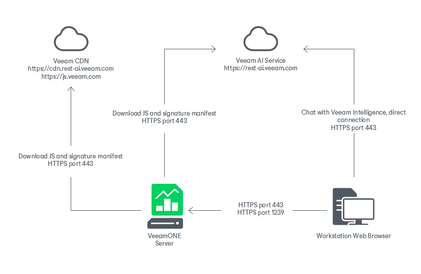
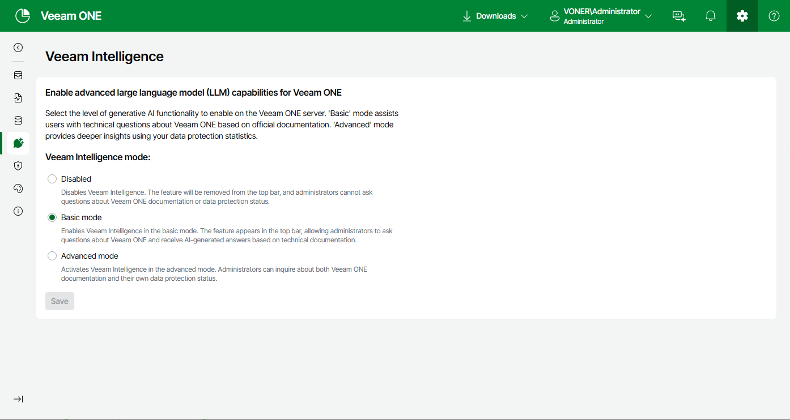

# Veeam Intelligence

Veeam Intelligence is an advanced Artificial Intelligence solution designed to assist customers with Veeam products. It searches for up-to-date information in the technical documentation and analyzes product data to provide recommendations using natural language. You can interact with Veeam Intelligence in any language, whether for simple queries or complex inquiries.

By default Veeam Intelligence is enabled in the Basic mode. In this mode, Veeam Intelligence assists users with technical questions about Veeam ONE based on official documentation. You can switch Veeam Intelligence to the Advanced mode which provides deeper insights into your infrastracture using Veeam ONE REST API.

For details on disabling or changing Veeam Intelligence, see [Veeam Intelligence Settings](veeam_intelligence_settings.md).

|  |
| --- |
| Important! |
| Consider the following:   * Only a currently installed license is used for authentication. If the license is changed, you must close Veeam Intelligence window and open it again. * Veeam Intelligence sends your queries outside of your organization. Be aware of this when writing queries related to private or confidential information. * Veeam takes no responsibility for the accuracy of the information that Veeam Intelligence provides. * Veeam Intelligence accepts only text input. * The Veeam Intelligence bot considers the context of all previous messages and may affect its consequent responses. If you need to clear the context of your conversation, refresh the page. * Veeam Intelligence is under constant development. Make sure to monitor additional improvements and features in future Veeam ONE releases and release notes. |

Limitations of Veeam Intelligence

Veeam Intelligence has the following limitations:

* The machine on which Veeam ONE Web Services runs must have internet access.
* Veeam Intelligence is only available to Veeam ONE Administrators. For all other user types, the Veeam Intelligence button is not available.
* Community and Perpetual (with expired support) licenses are not supported.
* Network access with the following conditions is required for the machine on which your workstation web browser and Veeam ONE Server runs:

* An open connection to rest-ai.veeam.com, cdn.rest-ai.veeam.com and js.veeam.com
* Port: 443
* Protocols used to communicate Veeam Intelligence queries: HTTPS and WSS (transport level: TCP)

Network communication between your workstation web browser, Veeam ONE Server and the Veeam AI Service is displayed in the following schema:

Veeam Intelligence Advanced Mode

Advanced mode allows additional searches of Veeam ONE API GET queries to provide additional answers specific to your environment. In Advanced mode, Veeam Intelligence has access to the following information to generate the answers you receive for your infrastructure:

* Veeam ONE Server and installation information
* Predefined and triggered alarms, including alarms for child objects
* Protected VMs, computers, storage and applications protected with Veeam Backup & Replication
* Cloud VMs, file share, database and network policies
* Cloud VMs, cloud file shares and cloud databases
* Veeam Backup & Replication servers and best practices
* All monitored Veeam Backup & Replication jobs

Using Veeam Intelligence

To start a new conversation:

1. Click Veeam Intelligence button located in the upper right corner of the Veeam ONE window.
2. In the chat window, type the question. Alternatively, click prompt to provide a short list of suggested questions. Consider the following examples:

* How to create an alarm notification?
* Where are Veeam ONE logs stored?
* How to change license?

* How can I use Veeam ONE to make sure my VMs are regularly checked?

1. Click Send or press Enter to send your question.

1. When you do not need Veeam Intelligence click the Close button to close the Veeam Intelligence window. The context and entire history is still saved when closed. If you refresh the page your conversation history is cleared.

Responses from Veeam Intelligence are generated in real-time, token-by-token, allowing users to begin reading as the AI continues writing the answer. Relevant links to Veeam documentation and Knowledge Base articles are integrated within the text. Note that screenshots and images are not supported in the current version.

If you find the answer to be insufficient, you can add more details. The bot retains the conversation context and previous questions within a current session, so you do not have to repeat anything. If you close the session, Veeam Intelligence restarts and loses the context of your previous conversation.

