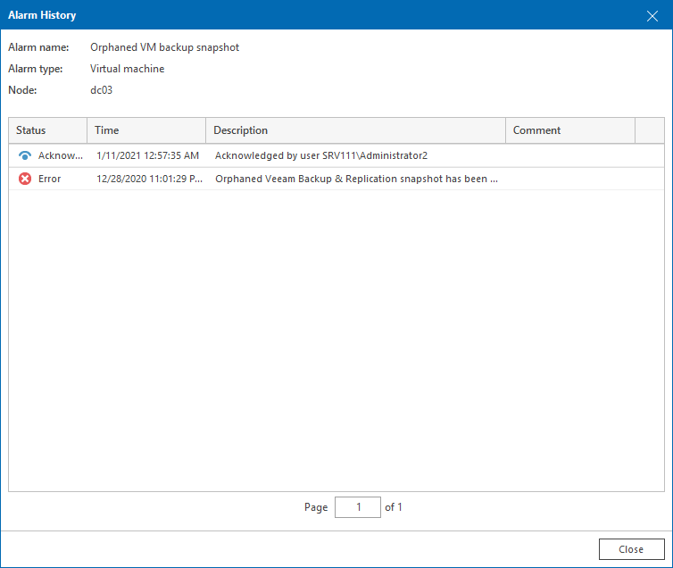

# Viewing Alarm History

Veeam ONE keeps the history of alarm status changes for every triggered alarm. You can track the number of times the alarm changed its status and view alarm history details: assigned status, time, rule that triggered the alarm or changed its state, and comments for resolved, remediated, or acknowledged alarms.

To view alarm history:

1. Open Veeam ONE Client.

For details, see [Accessing Veeam ONE Components](access.md).

1. At the bottom of the inventory pane, click the necessary view (Veeam Backup & Replication, Veeam Backup for Microsoft 365, Virtual Infrastructure, VMware Cloud Director, Business View).
2. In the information pane, open the Alarms tab.
3. Select the necessary alarm and do either of the following:

* Click the Repeat Count link in the list of alarms.
* Double-click the alarm in the list.
* Right-click the alarm and select Show History from the shortcut menu.
* In the Actions pane, click Show History.

