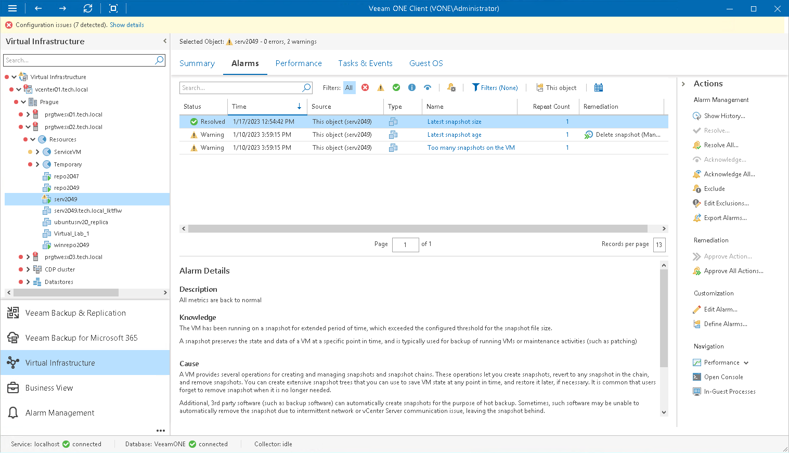
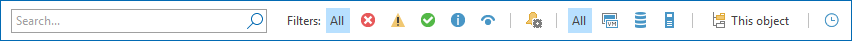

# Viewing Triggered Alarms

You can view alarms in both Veeam ONE Client and the Veeam ONE Web Client Alarms Overview screen.

Viewing alarms in Veeam ONE Web Client

To view alarms triggered for a specific infrastructure object:

1. Open Veeam ONE Web Client.

For details, see [Accessing Veeam ONE Components](access.md).

1. Open the Alarms Overview section.
2. At the bottom of the Alarms Overview, click on the necessary alarm in the Alarms list.

For details on the Alarms Overview alarms list, see [Alarms list](reporter_alarms_overview.md#alarms_list).

Viewing alarms in Veeam ONE Client

To view alarms triggered for a specific infrastructure object:

1. Open Veeam ONE Client.

For details, see [Accessing Veeam ONE Components](access.md).

1. At the bottom of the inventory pane, click the necessary view (Veeam Backup & Replication, Veeam Backup for Microsoft 365, Virtual Infrastructure, VMware Cloud Director, Business View).
2. In the inventory pane, select the necessary object.
3. In the information pane, open the Alarms tab.

The list of alarms shows alarms triggered for the selected infrastructure object and alarms for child objects.

For every alarm, the following details are available:

* Status — current status of the alarm (Warning, Error, Resolved, Info or Acknowledged). If an alarm was triggered multiple times, its latest state will be displayed in the list.
* Time — date and time when the alarm was triggered. If the alarm was triggered multiple times, the latest date time when the alarm was triggered will be displayed in the list.
* Source — name of the infrastructure object that caused the alarm. To view all alarms related to the infrastructure object, click the source link.
* Type — type of the infrastructure object that caused the alarm.
* Name — alarm name. Click the name link to open alarm details in the Alarm Management section.

If the alarm has been already deleted and not available in the Alarm Management section, the alarm name is shown as plain text.

* Repeat count — the number of times the alarm was triggered or changed its status. Click the repeat count link to view the alarm history.

For more details, see [Viewing Alarm History](view_alarm_history.md).

* Remediation — remediation action and resolution type configured for an alarm.

For more information on remediation actions, see [Alarm Remediation Actions](remediation_actions.md).

The Alarm details section of the information pane displays knowledge base for the selected alarm — description of the problem, possible causes, instructions for resolution, links to external resources, and other details.

The Actions pane on the right displays links to actions that you can perform against triggered alarms, as well as navigation links.

Searching for Alarms

To quickly find the necessary alarms, you can use filters and controls at the top of the Alarms list.

You can limit the list of alarms by the following criteria:

* To find alarms by alarm name, use the search field.
* To display or hide alarms with a specific severity, click the Status icons — Show alarms with all statuses, Show alarms with status "Error", Show alarms with status "Warning", Show alarms with status "Resolved", Show informational alarms, and Show alarms with status "Acknowledged".
* To display alarms with configured remediation actions, click the Show alarms with available Remediation Actions icon.
* To display or hide alarms for a specific type of infrastructure objects, click the object type icons — Show alarms for all types of objects or Show [object type] alarms.
* To display alarms that are related to the selected infrastructure object, use the This object icon. Release the icon to display alarms for the selected infrastructure object and alarms for its child objects. Press the icon to display alarms for the selected object only.
* To set the time interval within which alarms were triggered, use the Filter alarms by time period icon and set the necessary time interval. Release the icon to discard the time interval filter.

You can click column names to sort alarms by a specific parameter. For example, to view repetitive alarms, you can sort alarms in the list by Repeat Count in the descending order.

