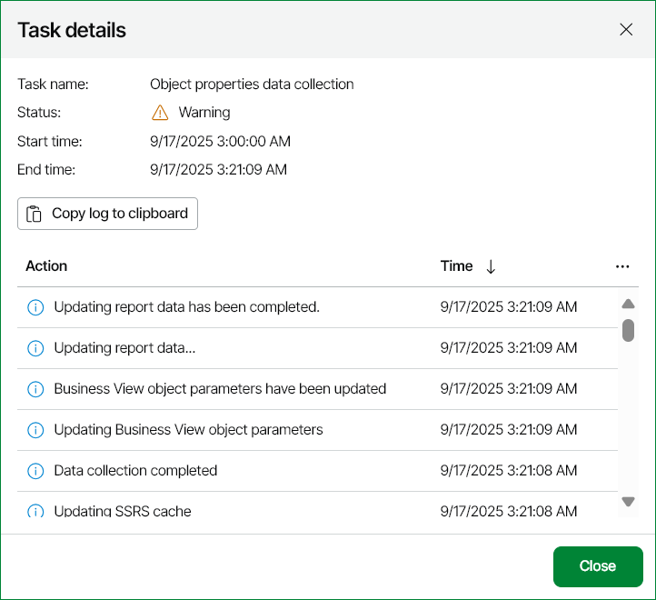

# Viewing Data Collection Session Details

Every run of data collection initiates a new data collection session. Veeam ONE keeps record of tasks performed during data collection sessions and stores this information, so that you can view session details.

To view data collection session details:

1. Open Veeam ONE Web Client.
2. At the top right corner of the Veeam ONE Web Client window, click Configuration.
3. Click Data Collection.
4. Open Task Sessions and click on the required Object properties data collection session from the Task Name list.

To easily find the necessary session, you can apply the following filters:

* Filter by name — search the list of sessions by name.
* Status — limit the list of sessions by status (Success, Warning, Failed, Processing, Stopped).
* Filter — limit the list of sessions by session type.
* Time period — limit the list of sessions by a defined time period.

Every session is described with the following details:

* Session type
* Session result
* Session start and end date and time
* Details on operations performed during the session

Database Maintenance Tasks

In addition to data collection, Veeam ONE periodically runs database maintenance tasks to delete data that must no longer be kept in the database according to the retention policy. Database maintenance tasks run every Sunday at 3:00 a.m.

Database maintenance task details are stored in the list of sessions. You can view details of database maintenance tasks similarly to viewing data collection session details.

