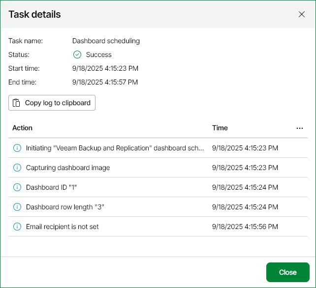

# Viewing Dashboard Delivery Results

Every dashboard delivery initiates a new delivery session.

To view details of dashboard delivery sessions:

1. Open Veeam ONE Web Client.
2. At the top right corner of the Veeam ONE Web Client window, click Configuration.
3. In the Data Collection tab, click Task Sessions.
4. To display all dashboard delivery sessions, click Filters, select Dashboard scheduling, and click Apply.
5. Click the necessary session in the list to display detailed information about it.

