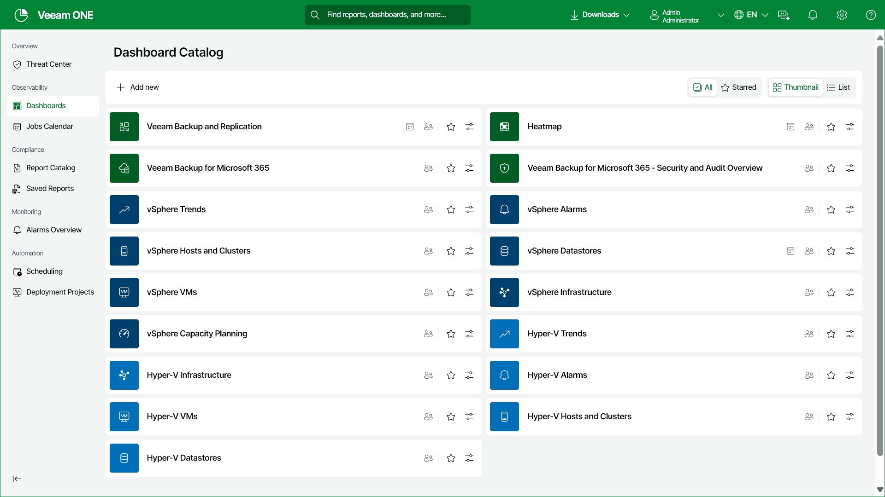
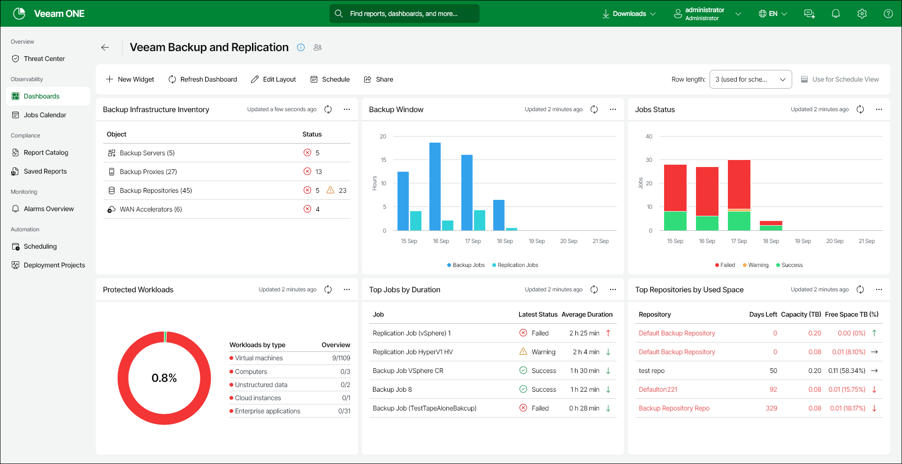

# Viewing Dashboards

Veeam ONE Web Client dashboards are available in the Dashboards section.

The Dashboards section displays preview images for available dashboards (dashboards for which data has been collected from connected servers). You can re-arrange the dashboards by dragging their preview images to the necessary position in the Dashboards section.

To view a dashboard:

1. Open Veeam ONE Web Client.
2. Open the Dashboards section.

* (Optional) Toggle between Thumbnail and List view to display.
* (Optional) Click the star on each dashboard to create a personalized list of you favorite dashboards accessible by the Starred button.

1. Click the dashboard preview image.

Dashboard Details

Dashboards are composed of widgets that display various aspects of the managed environment. Every widget is located in a separate cell, or entry, in the dashboard.

To get back to the list of dashboards, click the Dashboards tab on the left of the page, click the Go back button at the top left corner or use the browser Back button.

