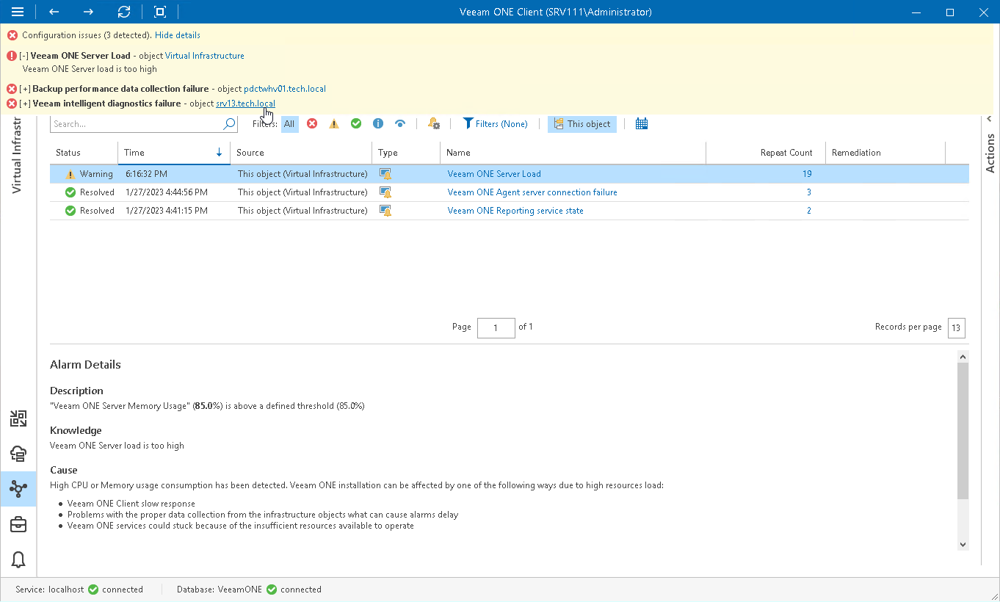

# Viewing Internal Alarms

To view Veeam ONE internal alarms:

1. Open Veeam ONE Client.

For details, see [Accessing Veeam ONE Components](access.md).

1. In the Configuration issues pane, click the Show details link.
2. Click the object name to drill down to the list of alarms for the selected object.

