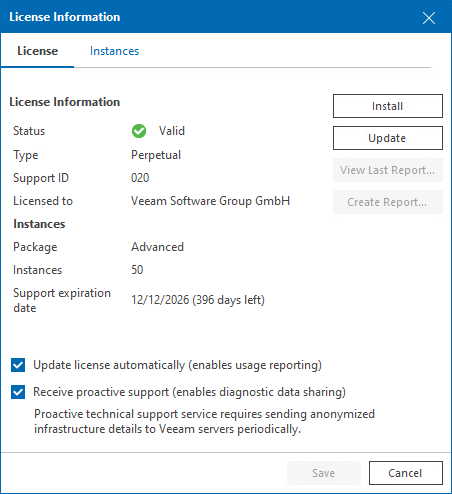
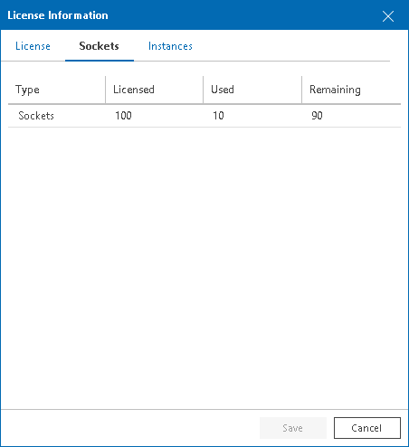
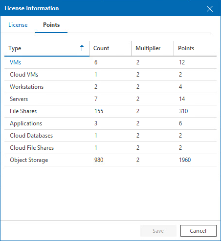

# Viewing License Information

You can check details of the installed license in the License Information window.

To access the Licensed Information window:

1. Open Veeam ONE Client.

For details, [Accessing Veeam ONE Components](access.md).

1. In the main menu, click License.

The License Information window will display license details.

License Information

The License Information section provides information about the current Veeam ONE license:

* Status — status of the installed license (Valid, Valid (License key is about to expire), Invalid, Expired (N days of grace period remaining), Warning (License exceeded), Not Installed).
* Type — type of the installed license (Perpetual, Subscription, Rental, Community, Evaluation, NFR).
* Licensed to — name of the user or company to which the license was issued.
* Expiration date — date when the license will expire.
* Package — license package (ONE, Suite, Essentials).
* Instances — number of instances that can cover managed objects.
* [For Rental license only] Points — number of points that can cover managed objects.
* Sockets  — number of sockets that the license covers.
* Expiration date — date when the license will expire.
* [For Perpetual license only] Support expiration date — date when product support will expire.
* Support ID — customer identification number required when contacting Veeam Technical Support.

License Usage

The Sockets and Instances tabs provide details on the number of currently used sockets, instances or points, and the number of managed objects with object multipliers for your license type.

These tabs contain the following information:

* Sockets — number of licensed, used and remaining sockets on managed VMware vSphere and Microsoft Hyper-V hosts.
* [For Rental license only] Used points — number of points consumed by managed objects out of the total number of instances available in the license.
* New — number of objects that were discovered less than a month ago (within the current calendar month). For details on new objects, see [Licensed Objects](licensed_objects.md).
* VMs — number of managed VMs out of the total number of discovered VMs on managed VMware vSphere and Microsoft Hyper-V hosts and Veeam Backup & Replication servers.

Click a link in the Type column to drill down to details on protected workloads.

* Workstations — number of managed Veeam Agents that run in Workstation mode and are managed by Veeam Backup & Replication servers connected to Veeam ONE.
* Servers — number of managed Veeam Agents that run in Server mode discovered and are managed by Veeam Backup & Replication servers connected to Veeam ONE.

* File Shares — number of managed data blocks (500 GB each) of file shares protected by Veeam Backup & Replication servers connected to Veeam ONE.
* Cloud VMs — number of Microsoft Azure VMs, Google Cloud VMs and AWS EC2 instances protected by Veeam Backup for Microsoft Azure, Veeam Backup for AWS and Veeam Backup for Google Cloud integrated with Veeam Backup & Replication servers that you connect to Veeam ONE.
* Cloud File Shares — number of AWS EFS and Microsoft Azure file shares protected by Veeam Backup for Microsoft Azure, Veeam Backup for AWS and Veeam Backup for Google Cloud integrated with Veeam Backup & Replication servers that you connect to Veeam ONE.
* Cloud Databases — number of Microsoft Azure SQL, AWS RDS, Google Cloud SQL databases protected by Veeam Backup for Microsoft Azure, Veeam Backup for AWS and Veeam Backup for Google Cloud integrated with Veeam Backup & Replication servers that you connect to Veeam ONE.
* [For Rental license only] Microsoft 365 users — number of users protected by Veeam Backup for Microsoft 365 and number of consumed instances.

Click a link in the Type column to drill down to details on protected workloads.

* Applications — number of enterprise applications protected with Veeam Plug-ins for SAP HANA, Oracle RMAN, SAP on Oracle, SAP on MadDB.
* Object Storage — number of managed data blocks (500 GB each) of Amazon S3, Azure Blob and S3 compatible storage data protected by Veeam Backup & Replication servers connected to Veeam ONE

