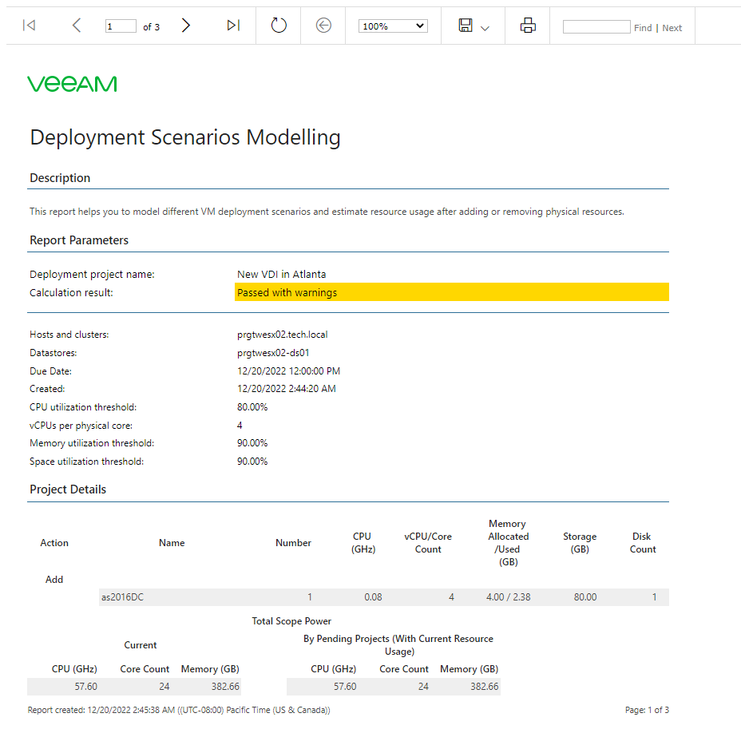
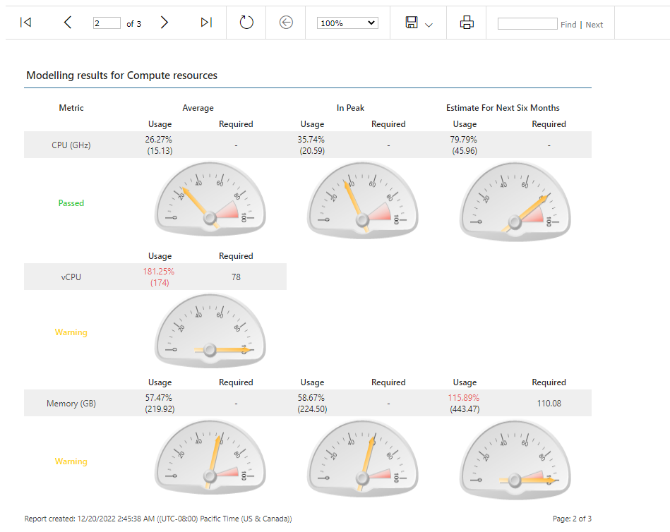
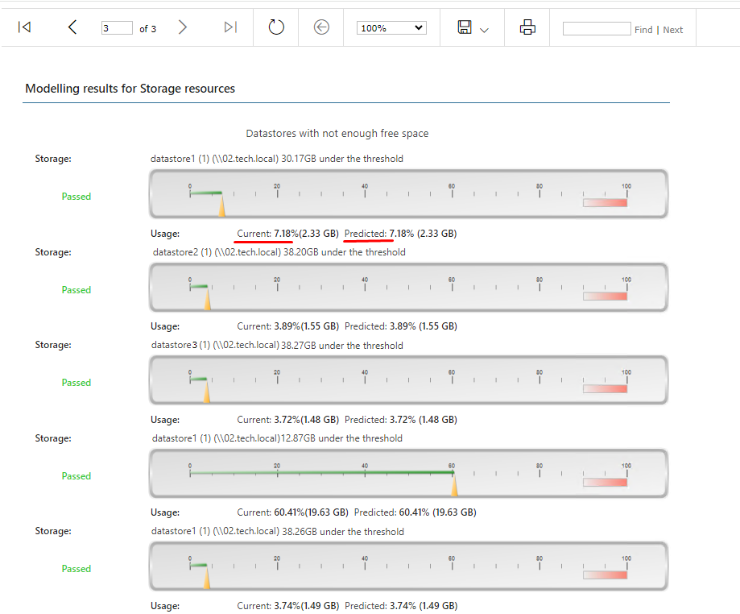

# Viewing Deployment Project Report

After you calculate a project, you can view a report detailing the outcome of the simulated deployment:

1. Open Veeam ONE Web Client.
2. Open the Deployment Projects section.
3. Select the necessary deployment project in the list and click View Report.

The report is designed to assist an administrator in implementing the deployment. The report details a projected resource usage, identifies a list of constraints and provides mitigation guidance.

The first report page outlines the projected changes and gives a summary of the constraining resources.

The subsequent pages show anticipated CPU, memory and storage usage levels and provide recommendations on capacity planning measures for maintaining robust and consistent performance in future.

The third report page displays storage modeling results including current and predicted storage usage.

Predicted storage usage shows expected user storage calculated in the following way: existing data on a storage plus space, reserved by previous linked projects plus space, reserved for new VMs minus space that can be released by deleted VMs.

