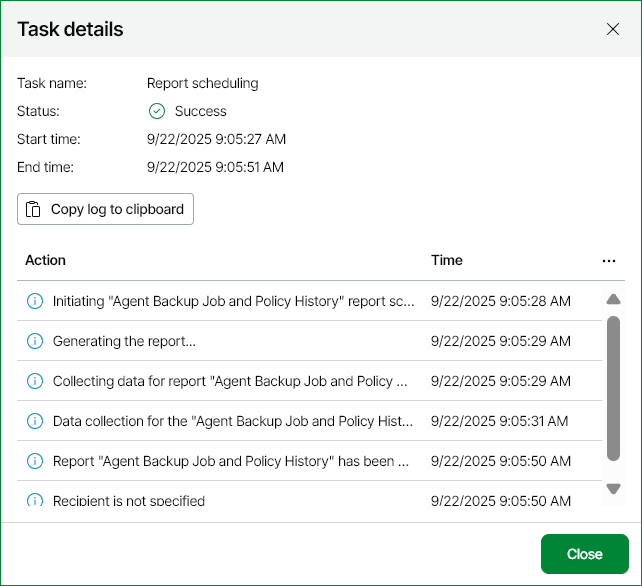

# Viewing Scheduled Report Delivery Results

Every run of a report or report folder scheduling job initiates a new scheduling session.

To view details on report or report folder scheduling sessions:

1. Open Veeam ONE Web Client.
2. At the top right corner of the Veeam ONE Web Client window, click Configuration.
3. In the configuration menu on the left, click Data Collection.
4. In the Data Collection screen click Task Sessions.
5. To display all report or report folder delivery sessions, click Filter, select Report scheduling or Report folder scheduling and click Apply.
6. Click the session in the list to display detailed information on it.

