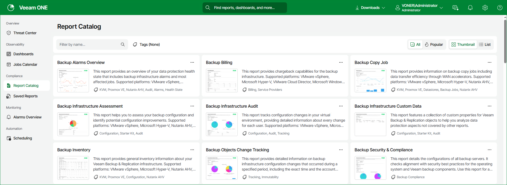
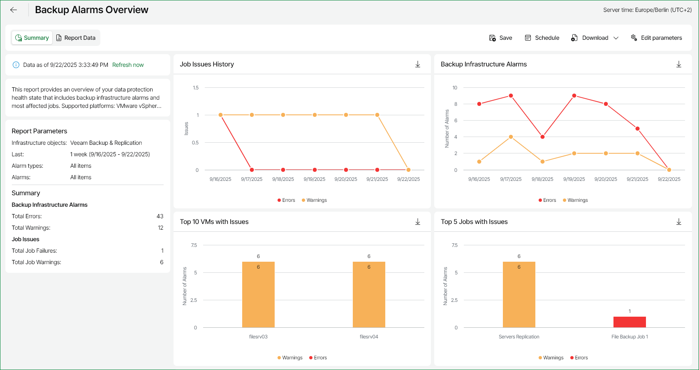

# Viewing Reports

Veeam ONE Web Client reports are available in the Report Catalog section.

The Report Catalog contains a list of all available reports on Veeam ONE. The Saved Reports tab contains your saved reports.

The User reports folder of the Saved reports tab contains reports created by users who have permissions assigned on objects in the vCenter Server or VMware Cloud Director inventory hierarchy. For details on, see [Multi-Tenant Monitoring and Reporting](multitenant.md).

|  |
| --- |
| Note: |
| Veeam ONE reports that use the legacy reporting engine are displayed in the browser pop-up windows. Before you create a report, make sure that pop-up windows are allowed from the Veeam ONE Web Client. |

To create a report:

1. Open Veeam ONE Web Client.
2. Open the Report Catalog section.
3. In the main screen, select the necessary report. You can also search for any particular report by adding a keyword into the Filter by name field.
4. In the displayed list of reports, click the necessary report.
5. Specify report parameters, such as the virtual or backup infrastructure scope, reporting period and so on.
6. At the bottom of the report parameters, click the Preview button.

The report will open in a pop-up browser window.

1. (Optional) Click the Popular tab to display the most popular reports selected on your system.
2. (Optional) Click Tags to open a list report name tags to further filter your search.

Navigating Reports

Veeam ONE reports vary depending on the type and input parameters. They can be short or span to several pages. Report data can be presented as graphs, charts, tables or text entries.

The navigation menu at the top of a report allows you to navigate the report and can include the following controls:

For reports supported by Veeam ONE version 13's new reporting engine (Veeam Backup & Replication and Veeam Backup for Microsoft 365 reports):

* Summary button — shows a summary of the report's details and associated charts and tables.
* Report Data button — shows additional tables and details of the report for further analysis.

* Filters — creates and applies logic filters to refine report displays.

* Save button — opens the Save Report window.
* Schedule button — opens the Add Report Schedule window.
* Download button — downloads the report in CSV or PDF format.
* Edit parameters button — opens the Report Settings panel to alter your report settings.

* Export chart button — downloads individual report charts in PNG, SVG, JPEG or CSV formats.
* Columns in the Report Data display allow you to:

* Drag columns to resize.
* Click Auto-size all to automatically organize columns.
* Click Group by to select displayed columns.
* Click Columns to in include or filter out columns.

For reports supported by Veeam ONE legacy reporting engine:

* Left/right arrow buttons — switch between the report pages.
* Fast forward/fast backward buttons — go to the last/first page of the report.
* Refresh button — update the report content with the latest collected data.
* Back button — return to the parent report from a drill-down report.
* Export menu (diskette icon) — save your report in one of the following file formats: Excel, Word or PDF.
* Go to page field — enter the necessary page number and press Enter on your keyboard to go to a specific page of the report.
* Zoom level field — zoom the report in/out.

* Print button — print the report.
* Search box — search for specific text within the report.

If Veeam ONE Web Client is integrated with the Microsoft SQL Reporting Services server, the following additional report formats are available: CSV (comma delimited), XML, MS PowerPoint, TIFF, MHTML, Data Feed.

Related Topics

* [Date and Time Format in Reports](report_date_time_format.md)
* [Saving Reports](save_reports.md)
* [Scheduling Reports](schedule_reports.md)

