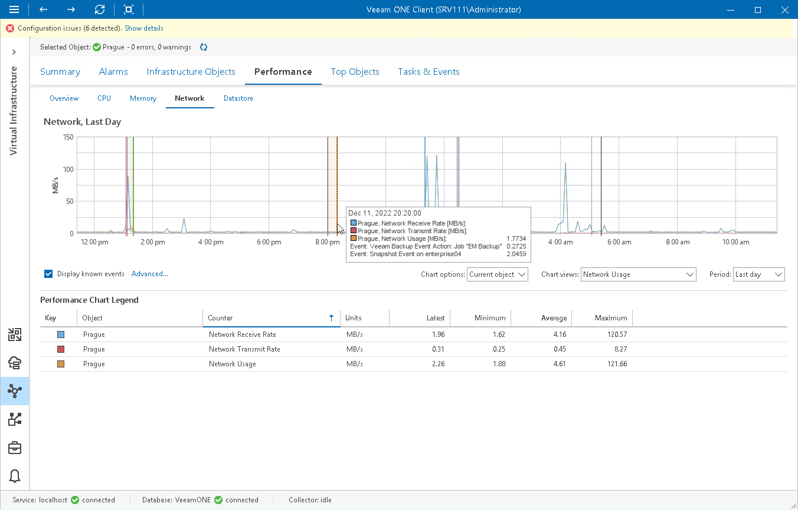
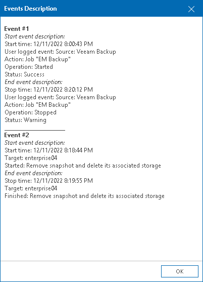

# Viewing Events on Performance Charts

Performance charts for VMware vSphere infrastructure objects allow you to display the following resource-consuming events:

* Live Migration (vMotion)
* Snapshot creation events
* Snapshot removal events
* Veeam Backup & Replication events

This option can help you detect events that caused performance degradation. For example, you can see what was the reason for a steep increase in the network resources usage.

To display events on a performance chart:

1. Open Veeam ONE Client.

For details, see [Accessing Veeam ONE Components](access.md).

1. At the bottom of the inventory pane, click Virtual Infrastructure.
2. In the inventory pane, select the necessary infrastructure object.
3. Open the necessary performance chart tab.
4. At the bottom of the performance chart, select the Display known events check box.
5. To choose what type of events to show on the performance chart, click the Advanced link next to the Display known events check box, and select the necessary events.

Events are shown as vertical lines crossing the performance graphs. To learn more about an event, hover the mouse cursor over it to see a tooltip, or click the line in the graph. The Events Description window will provide detailed information about the event.

|  |
| --- |
| Note: |
| The Display known events option is available only for time intervals not greater than 3 days. You will not be able to view events on the performance chart if a longer time interval is selected. |

