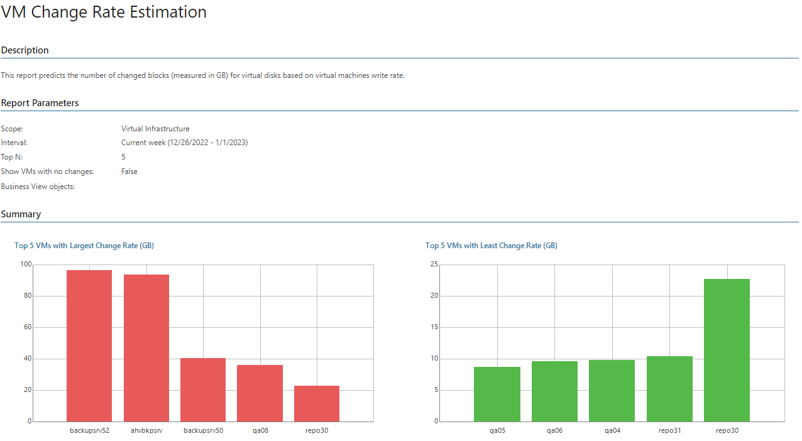

# VM Change Rate Estimation (Hyper-V)

This report predicts the number of changed blocks (measured in GB) for virtual disks based on virtual machines write rate. The report analyzes rates at which data was written to virtual disks during the selected reporting interval, and displays VMs that grew faster and slower than other VMs.

* The Summary section contains the following charts:

* The Top 5 VMs with Largest Change Rate (GB) chart shows 5 VMs with the greatest amount of changed blocks within the reporting period.

* The Top 5 VMs with Least Change Rate (GB) chart shows 5 VMs with the least amount of changed blocks within the reporting period.

* The Details table provides information on the total change rate and the hourly, daily or weekly change rate (depending on the reporting interval).

Click a VM name to drill down to change rate statistics for each VM disk.

Report Parameters

You can specify the following report parameters:

* Infrastructure objects: defines a virtual infrastructure level and its sub-components to analyze in the report.
* Business View objects: defines Business View groups to analyze in the report. The parameter options are limited to objects of the Virtual Machine type.

Business View groups from the same category are joined using Boolean OR operator, Business View groups from different categories are joined using Boolean AND operator. That is, if you select groups from the same category, the report will contain all objects that are included in groups. However, if you select groups from different categories, the report will contain only objects that are included in all selected groups.

* Period: defines the time period to analyze in the report.
* Top N: defines the number of top VMs that will be included in the report.
* Show VMs with no changes: defines whether VMs with no detected changes must be included in the report.

Use Case

To perform incremental backup, Veeam Backup & Replication needs to know which data blocks have changed since the previous job run. The number of changed blocks reflects the amount of data written to the virtual disk.

Veeam Backup & Replication gathers this information to calculate the amount of new data that needs to be backed up. The more changes occur on the virtual disk, the larger amount of space is required to store data in backup. By estimating the change rate, the report helps you assess future needs for repository space.

